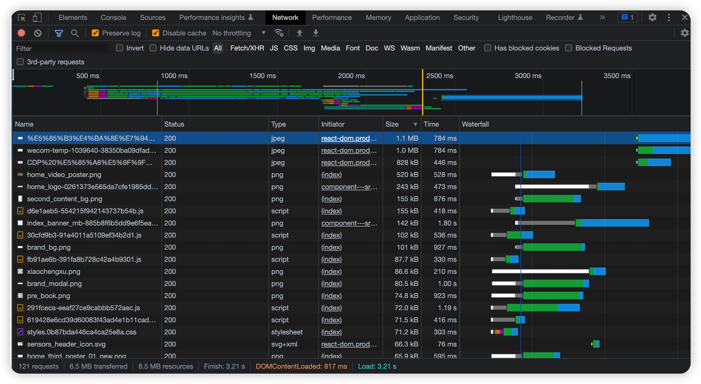
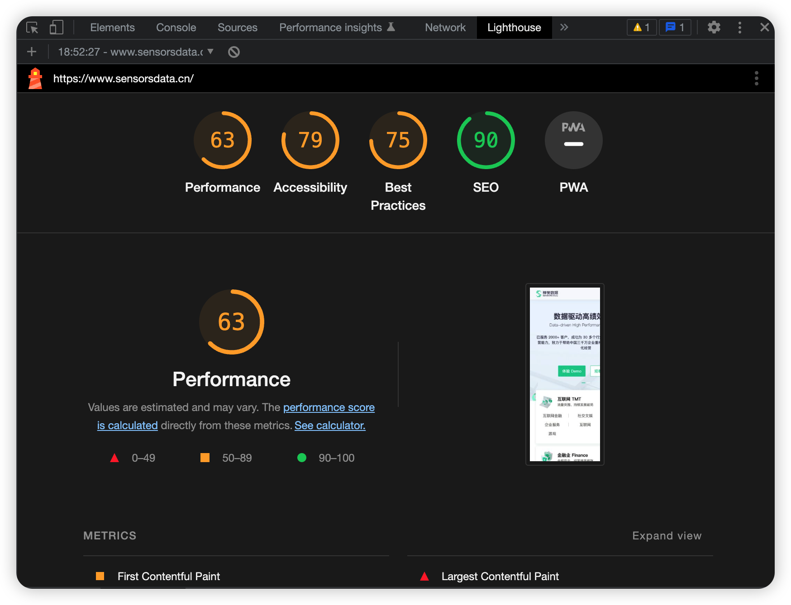
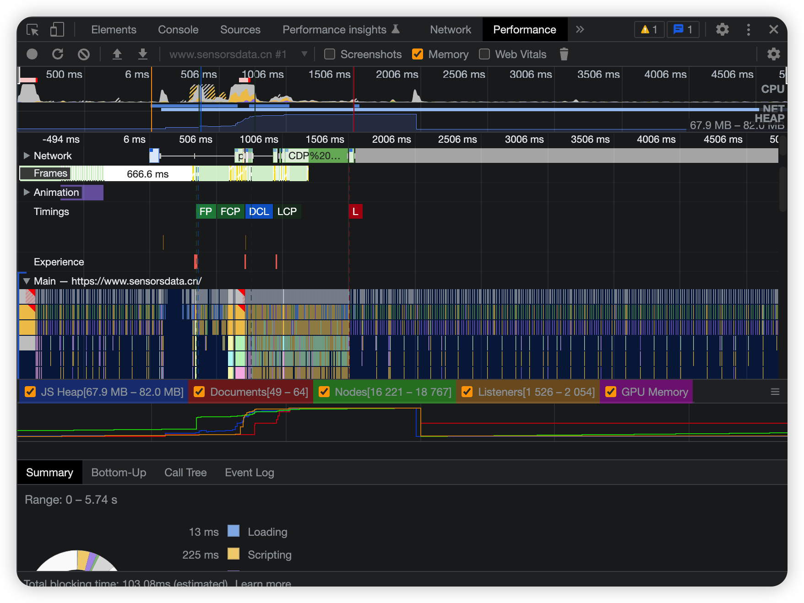
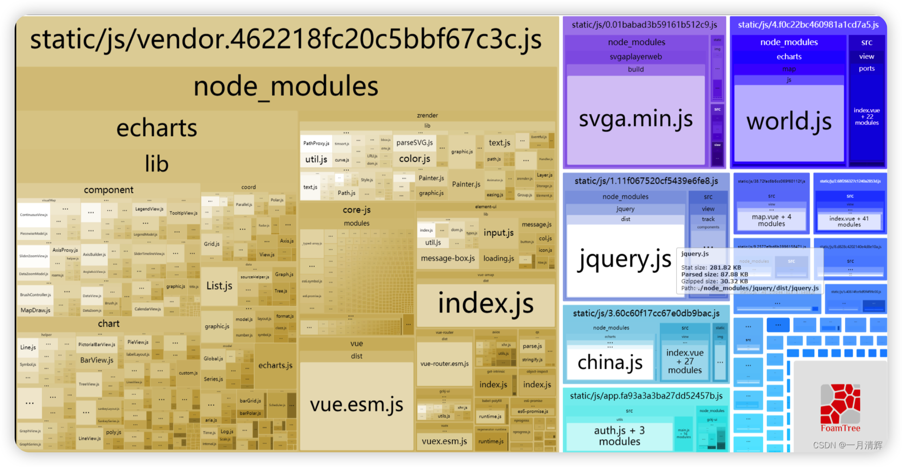

# 性能调试工具

## 浏览器的 Network
查看请求的响应时间，所下载的文件资源的体积、加载解析时间消耗等。

## 浏览器的 Lighthouse (性能评测)
查看首屏显示时间、首屏所加载的资源的利用率、第一次交互的时间、以及一些优化的方向等。

## 浏览器的 Performance

监听一段时间内的浏览器内存使用情况等。看是否有内存泄露的风险。

- **分析每个包的构成，每个包的大小**，再针对性的进行优化。
  比如说，包中仍然包含项目初期用到的mock；
  比如说，第三方的组件库(Ant-design组件、element-ui组件)，项目中只用到几个，但却被全量引入，导致包的体积过大。
- **从包的大小，数量分析，打包策略是否合理**

## webpack插件 `webpack-bundle-analyzer`

运行 `npm run build --report`，对打包后 js 文件的分析。

