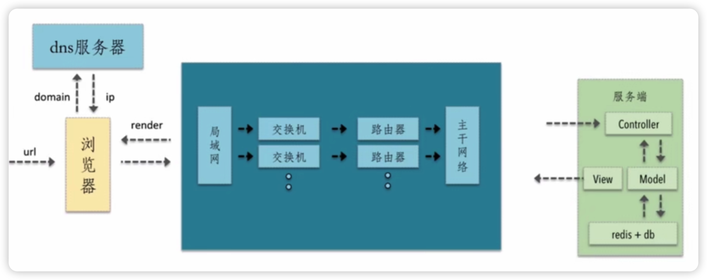
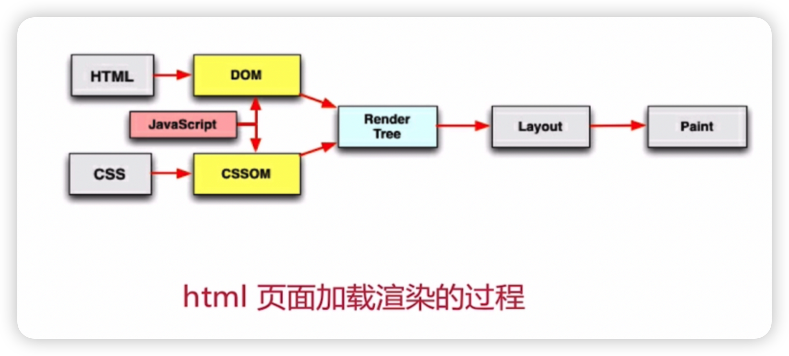
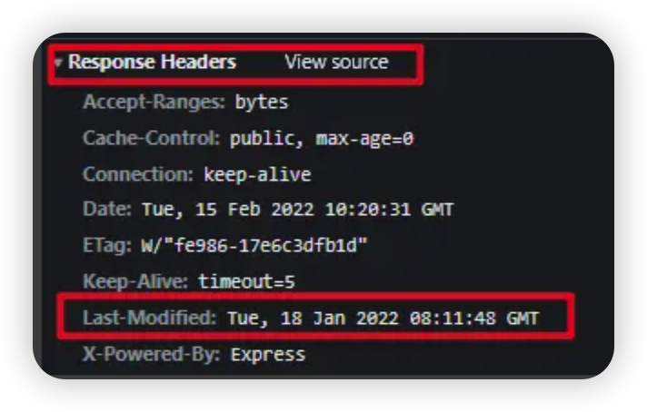
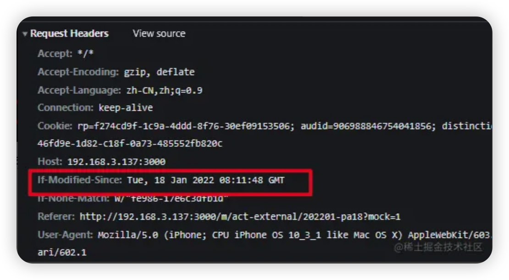

## 前端优化原理解析

### 一个请求从发出到返回结果经历了什么？



用户首先在浏览器中输入一个url，浏览器中的核心代码会将url进行拆分解析。浏览器会将domain发送到dns服务器，dns服务器会根据domain查询对应的ip地址，同时将ip地址返回给浏览器，浏览器在持有ip地址之后，就会知道这个请求要发送的地址，就跟随协议，将ip地址打在协议中，并且请求相关的参数都携带，发送到我们的网络中，经过局域网、交换机、路由器、主干网络，之后请求会到达我们的服务端，服务端是MVC架构，请求会首先进入到controller中，在controller中进行相关逻辑的分发，调用model层，model是与数据进行交互的，在数据进行交互中，去拿数据库的数据，最后将我们渲染好的数据通过view层分发到网络中，http请求的response就从服务端又回到了浏览器，浏览器就开始render。

潜在的性能优化点：

- 1、dns缓存
- 2、减少http请求
- 3、减小http请求的大小
- 4、网络请求的时候走最近的网络请求
- 5、浏览器端缓存

### 一个网站在浏览器端是如何进行渲染的？



请求返回一段HTML文档，这一段HTML文档会被浏览器中的HTML parse 这一个解析器进行解析，通过词法分析的过程将tag分析为token，依次从html文档中从上到下去解析token，因为他是用next token的方式不断的从上到下进行解析的，在词法分析的过程中是可以相应的解析出link script这样的标签，这样的标签里面所对应的web资源会进一步的由浏览器向网络发起请求。请求回来的JavaScript web资源会交给浏览器中的v8 JavaScript执行引擎去执行。css相关的资源请求回来之后会由浏览器生成相应的CSSOM树。页面渲染的前提是DOM树和CSSOM树都有了之后，去生成Render tree，进一步进行一个布局，从而进行绘制。

**总结**：从上面的两个问题我们可以看出前端性能优化的基础优化的核心就是减少http请求和减小http请求的大小。

## 减少资源大小

* html 压缩
* css 压缩
* js 压缩与混乱
* 图片压缩
* 开启 gzip

### 开启 gzip

`webpack` 配置 gzip：

```js
const CompressionWebpackPlugin = require('compression-webpack-plugin')
module.exports = {
  ......
  configureWebpack: config => {
    config.plugins.push(new CompressionPlugin({
          filename: '[path].gz[query]',
          algorithm: 'gzip',
          test:/\.js$|\.html$|.\css/, // 匹配文件名
          threshold: 10240, // 对超过10k的数据压缩
          minRatio: 0.8, // 只有压缩好这个比率的资产才能被处理
          deleteOriginalAssets: true // 删除源文件
       }));
  }
}
```

`nginx` 配置如下：

```nginx
 gzip on; #开启或关闭gzip on off
 gzip_disable "msie6"; #不使用gzip IE6
 gzip_min_length 100k; #gzip压缩最小文件大小，超出进行压缩（自行调节）
 gzip_buffers 4 16k; #buffer 不用修改
 gzip_comp_level 8; #压缩级别:1-10，数字越大压缩的越好，时间也越长
 gzip_types text/plain application/x-javascript text/css application/xml text/javascript application/x-httpd-php image/jpeg image/gif image/png; #  压缩文件类型 
 gzip_vary off;
```

## 减少 http 请求数量

* 雪碧图
* Image Inline
* 请求合并

## 首屏渲染问题

* 公共代码抽离
* 不同页面分离打包

## 优化网络链接

* CDN

## http 缓存

### 强缓存

强缓存不会发送请求，直接使用，设置强缓存可以减少不必要请求。
命中强缓存时，浏览器并不会发起请求，在Chrome开发者工具中可以看到http返回的状态码是`200`,size列会显示为`memory cache`或 `disk cache`。

* **memory cache**
  * 不访问服务器，一般已经加载过该资源且缓存在了内存当中，直接从内存中读取缓存。**浏览器关闭后，数据将不存在**（资源被释放掉了），再次打开相同的页面时，不会出现memory cache。
* **disk cache**
  * 不访问服务器，已经在之前的某个时间加载过该资源，直接从硬盘中读取缓存，**关闭浏览器后，数据依然存在**，此资源不会随着该页面的关闭而释放掉下次打开仍然会是 disk cache。

强缓存是利用http的返回头中的 `Expires` 或者 `Cache-Control` 两个字段来控制的，用来表示资源的缓存时间。

#### Expires

该字段返回一个时间，如 `expires: Sun, 14 Aug 2022 08:50:40 GMT`，代表资源的失效时间，即在2022/08/14 08:50:40之前都是有效的。

Expires的缺点：
失效时间是绝对时间，本地时间被修改之后导致服务器与客户端时间出现偏差过大，导致缓存混乱

#### Cache-Control

为了弥补 Expires 的缺点，Cache-Control 出现了，Cache-Control 不依赖客户端时间。 该字段是一个相对时间，如`cache-control: max-age=3600` ，表示资源有效期是3600秒。

Expires 和 Cache-Control 可以同时配置启用，也可单独启用，同时启用时 Cache-Control 优先级最高。

`cache-control` 主要有 `max-age` 和 `s-maxage`、`public` 和 `private`、`no-cache` 和 `no-store` 等值。

* `max-age` 和 `s-maxage` 
  两者是 `cache-control` 的主要字段，它们是一个数字，表示资源过了多少秒之后变为无效。在浏览器中，`max-age` 和 `s-maxage` 都起作用，而且 `s-maxage` 的优先级高于 `max-age`。在代理服务器中，只有 `s-maxage` 起作用。 可以通过设置 `max-age` 为 0 表示立马过期来向服务器请求资源。
* `public` 和 `private`
  `public` 表示该资源可以被所有客户端和代理服务器缓存，而 `private` 表示该资源仅能客户端缓存。默认值是 `private`，当设置了 `s-maxage` 的时候表示允许代理服务器缓存，相当于 `public`。
* `no-cache` 和 `no-store`
  `no-cache` 表示的是不直接询问浏览器缓存情况，而是去向服务器**验证**当前资源是否更新（即协商缓存）。`no-store` 则更狠，完全不使用缓存策略，不缓存请求或响应的任何内容，直接向服务器请求最新。由于两者都不考虑缓存情况而是直接与服务器交互，所以当 `no-cache` 和 `no-store` 存在时会直接忽略 `max-age` 等。

### 协商缓存

若未命中强缓存，则浏览器会请求服务器，服务器根据http头信息中的 `Last-Modify/if-Modify-Since` 或 `Etag/If-None-Match` 来判断是否命中协商缓存，如果命中则返回状态码304，浏览器就在缓存中加载资源。

#### Last-Modified / if-Modified-Since

* 第一次请求时，服务器的**返回头**中会返回`last-modified` 记录资源最后修改的时间
* 当再次请求该资源时，**请求头**中会带有 `if-modified-since` 字段，值是之前返回的 `last-modified` 的值
* 服务器收到 `if-modified-since` 后根据资源的最后修改时间来判断是否命中缓存判断规则
* 若一致则证明没有被修改，告知浏览器可直接使用缓存并返回 304；若不一致则直接返回修改后的资源，并修改 `last-modified` 为新的值。

第一次请求，响应头：



再次请求，请求头：



#### Etag/If-None-Match

* `Etag/If-None-Match`返回的是一个校验码，Etag可以保证每个资源是唯一的，资源变化导致Etag变化。 
* 首次请求，**响应头**会返回 `Etag` 的值回来
* 再次请求，服务器会根据**请求头**上的`If-None-Match`来判断是否命中缓存，`If-None-Match`值是之前返回的 `Etag` 值

ETag 中有强 ETag 值和弱 ETag 值之分：

* 强 ETag 值，不论实体发生多么细微的变化都会改变其值。

  * > ETag: "usagi-1234"

* 弱 ETag 值只用于提示资源是否相同。只有资源发生了根本改变，产生差异时才会改变 ETag 值。这时，会在字段值最开始处附加 W/。

  * > ETag: W/"usagi-1234"

#### Etag与Last-Modified的区别

* `Last-Modified`只能精确到秒，1秒内多处修改无法准确标注文件修改时间
* `Etag`优先级高
* `Etag` 比 `last-modified` 更加精准地感知了变化
* `Etag` 生成标识字符串会增加服务器的开销
