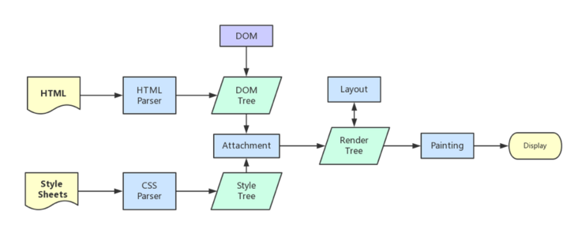

# 性能优化之从URL到页面展示

可以参考这篇文章，从这个角度来总结前端性能优化，比较容易理解： https://juejin.cn/post/6844904025519816711

> “从输入 URL 到页面加载完成，发生了什么？”作为引子开启话题，这个面试题从大处着手思考，就是两个重要知识维度，一是`网络层面`，二是`渲染层面`。往细处说前者牵涉到DNS（域名解析系统）、IP寻址、TCP连接、http请求与响应等；后者则是进程与线程概念、DOM树、层叠样式、重排与重绘及合成等。 小册里面有一张性能优化的思维导图贴出来分享给大家

##### 简单分析下浏览器在拿到 html 后做的事情：

浏览器渲染进程拿到 html 后，交给GUI渲染线程， GUI 线程会进行 dom 树的解析，遇到内联 css 则进行 CSSOM 构建（*由于内联 CSS 的代码量比较少，所以浏览器在解析 HTML 文档时会将其与 HTML 文档一起解析，而不会像外部 CSS 文件那样单独进行 Parse Stylesheet 的解析过程*）， 遇到外链 css 则进行加载并构建CSSOM（这一步会阻塞 RenderTree 的构建），外链 css 加载完毕 => **Parse Stylesheet**  => Recalculate Style => 构建 Render Tree =>  Layout（布局：元素尺寸、位置计算） => Paint(绘制：绘制页面像素信息)   => 把各层数据交给 GPU,GPU把各层合成（composite）, 显示在屏幕上。

**Parse Stylesheet**： Parse Stylesheet会将样式表文件中的内容解析为一颗CSSOM（CSS Object Model）树，这棵树包含了所有的样式规则和对应的元素选择器、样式属性等信息。通过这个过程，浏览器就能够理解样式表的含义并准确地应用样式规则。

**Recalculate Style**： 指在网页渲染的过程中根据当前的文档结构和样式规则重新计算元素的样式。当文档结构或样式发生变化时，浏览器需要重新计算元素的样式，以保持页面的正确渲染。Recalculate Style会从CSSOM树中获取每个元素对应的样式规则，并根据规则计算元素的最终样式。

**问题点和优化点：**

Head 头中的外链 css 的加载不会阻塞 dom 树的解析，但是最终构建的 RenderTree 是要等待解析出来的CSSOM ，因此外链 css 加载时间过长，会加长首屏的空白时长。

优化： 

1. 可以通过 cdn + 缓存的方式进行优化。 
2. 压缩 css 文件 + gzip 优化文件大小。

根据复合层的优化点：

GPU 会生成一个默认复合层，在这个复合层上做的改动会引起回流和重绘。 我们可以通过设置 translate3d 或者 fixed  （或者使用video/canvas/iframe/webgl元素）  让 GPU 给指定元素单独创建一个复合层，让其真正脱离文档流，即便做了改动，也不会影响默认复合层的回流和重绘，提升性能。但是尽量不要大量创建复合层，否则资源消耗过度，页面反而会更卡。

