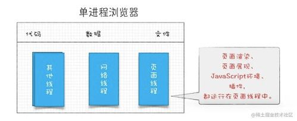
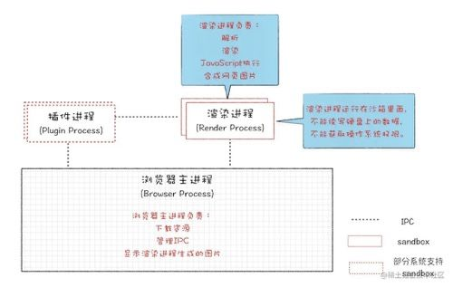

## 历史

浏览器在2007年左右大部分都是单进程架构，单进程有诸多缺点：1.不稳定 2.不流畅 3.不安全。

2008年Chrome发布了多进程架构。

## 多进程浏览器

1. 浏览器是多进程的。
   1. **browser 进程**：浏览器的主进程，负责界面显示、用户交互、子进程管理，同时提供存储功能。
   2. GPU进程：初衷是为了渲染3D CSS 效果，后面网页和UI都采用GPU绘制。
   3. network 进程： 负责网络资源的加载。
   4. **浏览器渲染进程（浏览器内核）**：内部是多线程的，默认每个Tab是一个渲染进程。
      1. 主要作用：页面渲染、js 执行、事件处理。
   5. 第三方插件进程：每个插件对应一个进程。

#### 浏览器渲染进程（重点讲下这里）

每打开一个 tab 页面，就会创建一个浏览器渲染进程。每个进程都会包含多个线程。如下：

1. GUI渲染线程
   1. 负责渲染浏览器界面，解析HTML，CSS，构建DOM树和RenderObject树，布局和绘制等。
   2. 当界面需要重绘（Repaint）或由于某种操作引发回流(reflow)时，该线程就会执行
   3. 注意，**GUI渲染线程与JS引擎线程是互斥的**，当JS引擎执行时GUI线程会被挂起（相当于被冻结了），GUI更新会被保存在一个队列中**等到JS引擎空闲时**立即被执行。
2. JS 引擎线程
   1. 也称为JS内核，负责处理Javascript脚本程序。（例如V8引擎）
   2. JS引擎线程负责解析Javascript脚本，运行代码。
   3. JS引擎一直等待着任务队列中任务的到来，然后加以处理，一个Tab页（renderer进程）中无论什么时候都只有一个JS线程在运行JS程序
   4. 同样注意，**GUI渲染线程与JS引擎线程是互斥的**，所以如果JS执行的时间过长，这样就会造成页面的渲染不连贯，导致页面渲染加载阻塞。
3. 事件触发线程
   1. 归属于浏览器而不是JS引擎，用来控制事件循环（可以理解，JS引擎自己都忙不过来，需要浏览器另开线程协助）
   2. 当JS引擎执行代码块如setTimeOut时（也可来自浏览器内核的其他线程,如鼠标点击、AJAX异步请求等），会将对应任务添加到事件线程中
   3. 当对应的事件符合触发条件被触发时，该线程会把事件添加到待处理队列的队尾，等待JS引擎的处理
   4. 注意，由于JS的单线程关系，所以这些待处理队列中的事件都得排队等待JS引擎处理（当JS引擎空闲时才会去执行）
4. 定时任务线程
   1. 传说中的`setInterval`与`setTimeout`所在线程
   2. 浏览器定时计数器并不是由JavaScript引擎计数的,（因为JavaScript引擎是单线程的, 如果处于阻塞线程状态就会影响记计时的准确）
   3. 因此通过单独线程来计时并触发定时（计时完毕后，添加到事件队列中，等待JS引擎空闲后执行）
   4. 注意，W3C在HTML标准中规定，规定要求setTimeout中低于4ms的时间间隔算为4ms。
5. 网络http异步请求线程
   1. 在XMLHttpRequest在连接后是通过浏览器新开一个线程请求
   2. 将检测到状态变更时，如果设置有回调函数，异步线程就**产生状态变更事件**，将这个回调再放入事件队列中。再由JavaScript引擎执行。

## 参考

https://www.cnblogs.com/cangqinglang/p/8963557.html

https://www.freecodecamp.org/chinese/news/the-evolution-process-and-background-of-browser-technology-architecture/