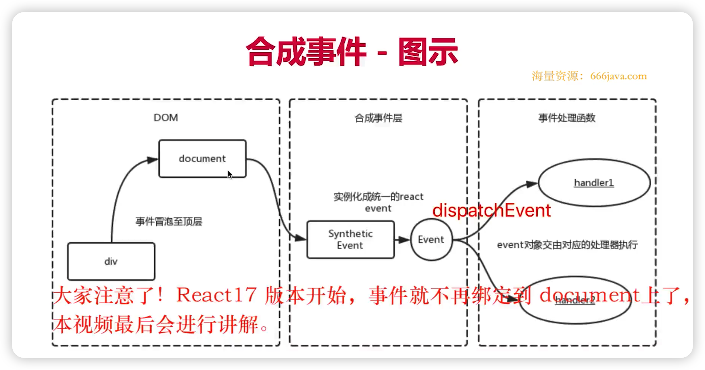
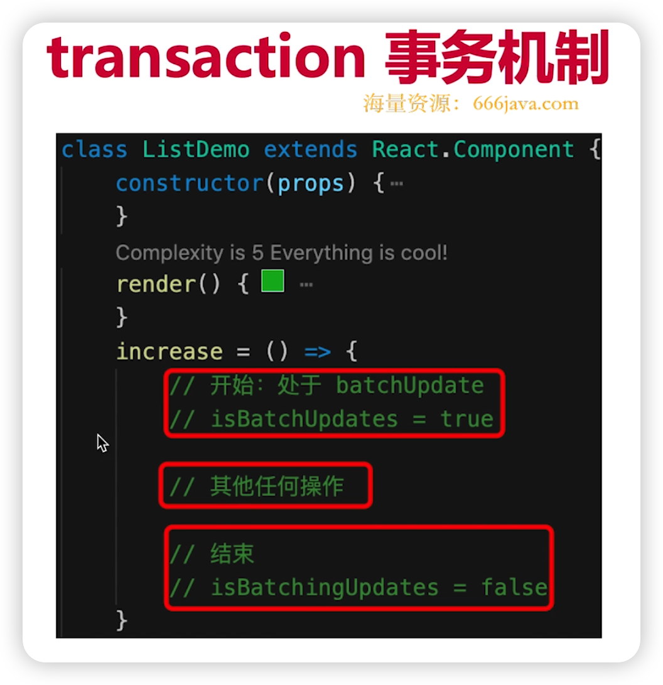
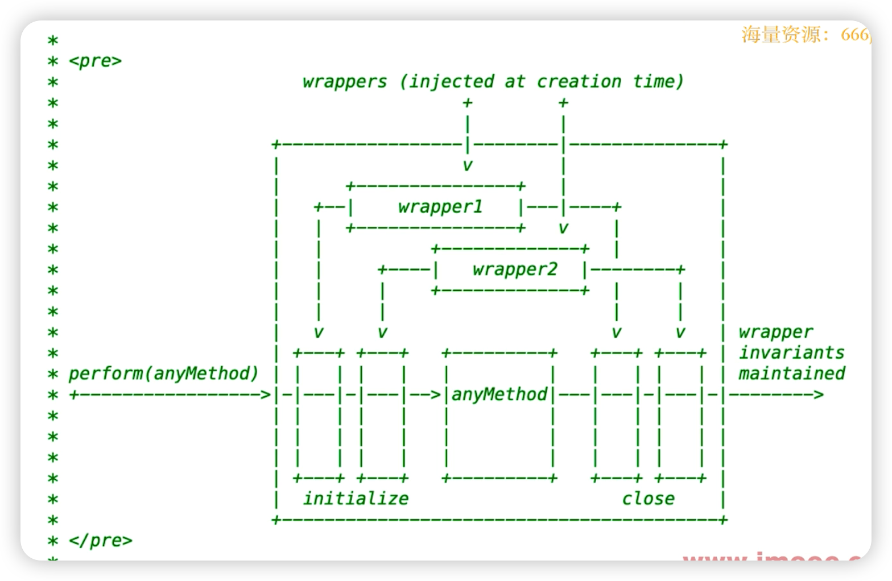
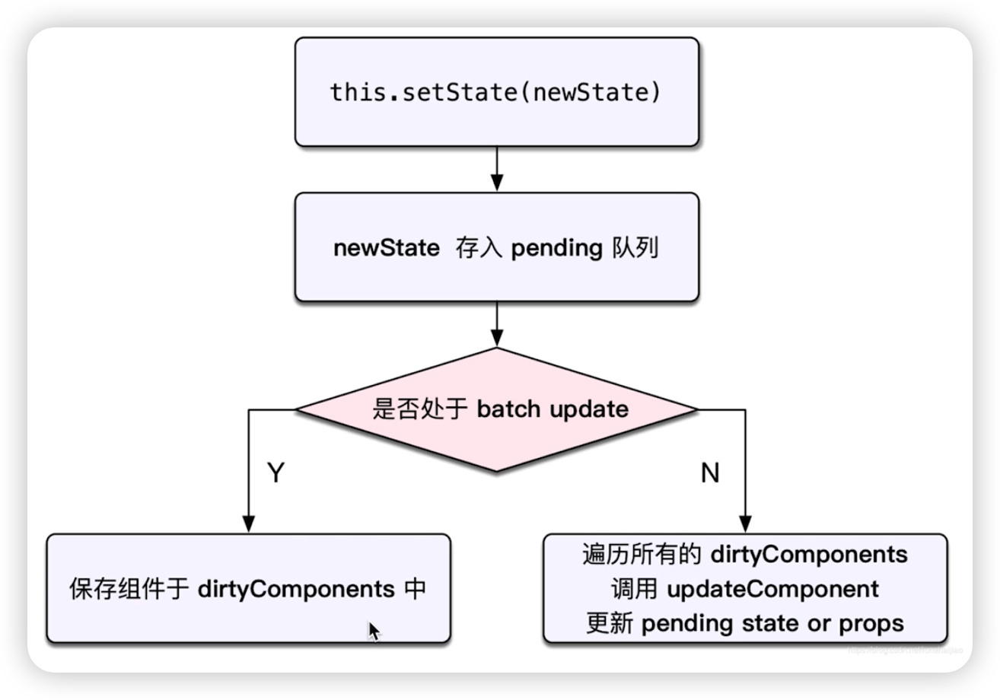

# React 原理

* 函数式编程
* vdom 和 diff
* JSX本质
* 合成事件机制

## 函数式编程

* 一种编程范式
* 纯函数
* 不可变值

## vdom 和 diff

### vdom

* h 函数
* vnode 数据结构
* patch 函数

### diff

* 只比较同一层级，不跨级比较
* tag 不相同，直接删除重建，不再深度比较
* tag 和 key，两者都相同，则认为是相同节点，不再深度比较

核心概念和实现思路，最重要

## JSX 本质

* JSX 等同于 Vue 模板
* Vue 模板不是 html
* JSX 也不是 JS

`React.createElement(type, props, childs)`

* `React.createElement` 即 h 函数，返回 vnode
* 第一个参数，可能是组件，也可能是 html tag
* 组件名，首字母必须大写（React 规定）

执行过程

* JSX 即 `createElement` 函数
* 执行生成 `vnode`
* `patch(elem, vnode)` 和 `patch(vnode, newVnode)`

## 合成事件

* 所有事件挂载到 document 上（React 17 之前）
  * React 17 开始，事件挂载到 根节点 root 上
* event 不是原生的，是 `SyntheticEvent` 合成事件对象
* 和 Vue 事件不同，和 DOM 事件也不同

### 为何要合成事件机制？

* 更好的兼容和跨平台
* 挂载到 document，减少内存消耗，避免频繁解绑
* 方便事件的统一管理（事务机制）

### React 17 事件绑定到 root

* React 16 绑定到 document
* React 17 事件绑定到 root 组件
* 有利于多个 React 版本并存，如微前端 

## setState 和 batchUpdate

* 有时异步（普通使用），有时同步（setTimeout，自定义 DOM 事件）
* 有时合并（对象形式），有时不合并（函数形式）
* 后者比较好理解（想 `Object.assign`）

### 核心要点

* `setState` 主流程
* `batchUpdate` 机制
* `transaction`（事务）机制

### setState 异步还是同步？

* `setState` 无所谓异步还是同步
* 看是否能命中 `batchUpdate` 机制
* 判断 `isBatchingUpdates` 是 `true` 还是 `false`

### 哪些能命中 batchUpdate 机制

* 生命周期（和它调用的函数）
* React 中注册的事件
* React 可以管理的入口

### 哪些不能命中 batchUpdate 机制

* setTimeout setInterval 等
* 自定义的 DOM 事件
* React 管不到的入口

### transaction事务机制

## 组件渲染和更新过程

* JSX 如何渲染为页面
* setState 之后如何更新页面
* 面试考察全流程

### dirtyComponents

### 组件渲染过程

* props state
* render() 生成 vnode
* patch(elem, vnode)

### 组件更新过程

* setState(newState) => dirtyComponents（可能有子组件）
* render() 生成 newVnode
* patch(vnode, newVnode)

### 更新的两个阶段

* patch 被拆分两个阶段
* **reconciliation 阶段** - 执行diff 算法，纯 JS 计算
* **commit 阶段** - 将 diff 结果渲染 DOM

如果不拆分可能会有性能问题

* JS 是单线程，且和 DOM 渲染公用一个线程
* 当组件足够复杂，组件更新时计算和渲染都压力大
* 同时再有 DOM 操作需求（动画，鼠标拖拽等），将卡顿

## React fiber

* 将 reconciliation 阶段进行任务拆分（commit 无法拆分）
* DOM 需要渲染时暂停，空闲时恢复
* window.requestIdleCallback

