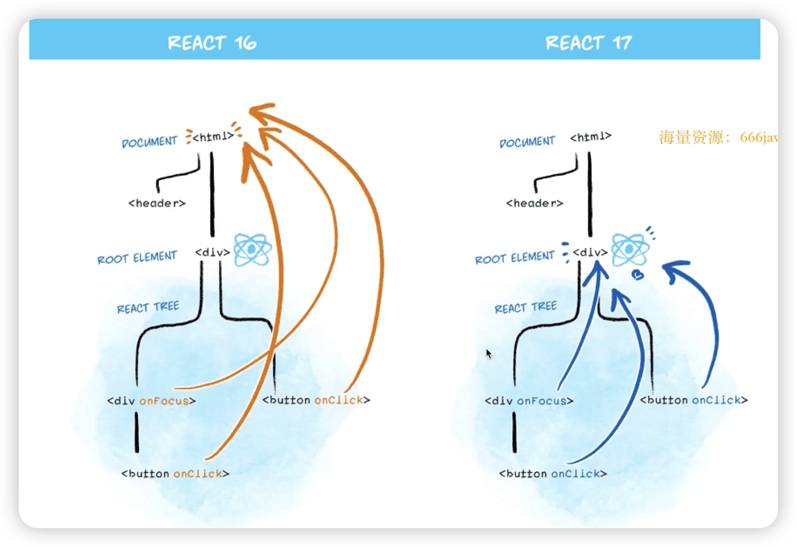
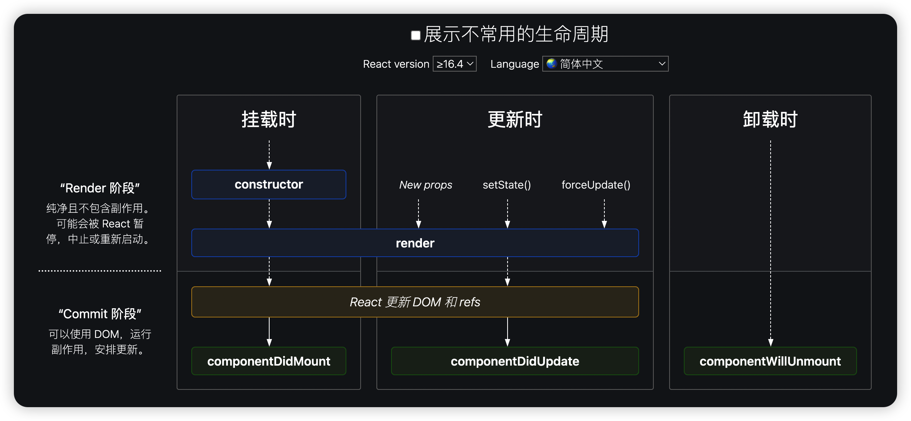
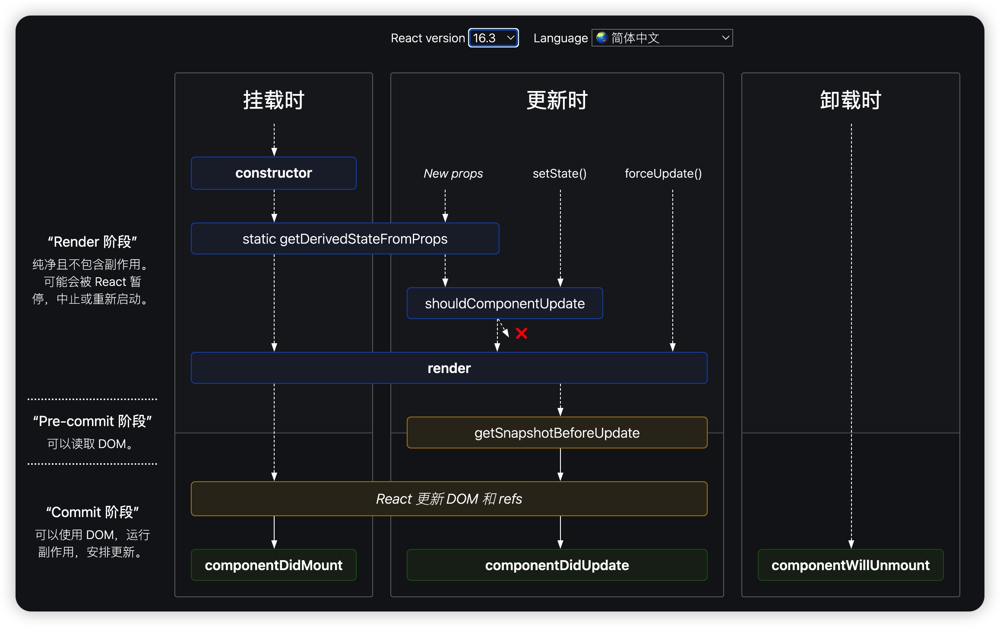
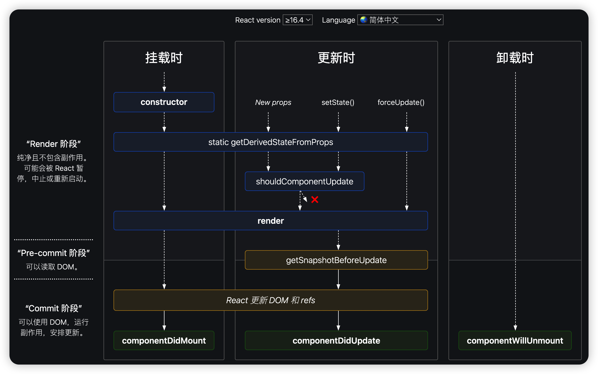

# 面试题

* React 组件如何通讯？
* JSX 本质是什么？
* context 是什么，有何用途？
* shouldComponetUpdate 的用途
* 描述 redux 单项数据流
* setState 是同步还是异步？

# React 事件

## 为何需要 bind this

* this 默认是 undefined。
* 箭头函数
* SyntheticEvent 合成事件
* event.nativeEvnet 原生事件

## React 17 事件

React 17 开始，事件不再绑定在 document 上。

* React 16 绑定在 document 
* React 17 事件绑定到 root 组件
* 有利于多个 React 版本共存，如 微前端

# 表单

* 受控组件：表单组件受 state 控制
* input textarea select 用value
* checkbox radio 用 checked
* 非受控组件：表单组件不受 state 控制

# 组件

* props 传递数据
* props 传递函数
* props 类型检查 - propTypes

# setState

* 不可变值
  * 不能直接修改 state
  * SCU（shouldComponentUpdate）
* 可能是异步更新 
  * React 17 及之前
* 可能会被合并 
  * React 17 及之前
  * 连续调用，传入对象会被合并
  * 传入函数不会被合并

## React 18 setState 变化

* React <= 17
  * React 组件事件：异步更新，合并 state
  * DOM 事件，setTimeout：同步更新，不合并 state
* React 18
  * React 组件事件：异步更新，合并 state
  * DOM 事件，setTimeout：异步更新，合并 state
  * Automatic Batching 自动批处理

# 组件生命周期 

https://projects.wojtekmaj.pl/react-lifecycle-methods-diagram/

## 16.3

## >= 16.4

## 父子组件生命周期

### 父子组件初始化

* 父组件 `constructor`
* 父组件 `getDerivedStateFromProps`
* 父组件 `render`
* 子组件 `constructor`
* 子组件 `getDerivedStateFromProps`
* 子组件 `render`
* 子组件 `componentDidMount`
* 父组件 `componentDidMount`

### 子组件修改自身 state

* 子组件 `getDerivedStateFromProps`
* 子组件 `shouldComponentUpdate`
* 子组件 `render`
* 子组件 `getSnapshotBeforeUpdate`
* 子组件 `componentDidUpdate`

### 父组件修改 props

* 父组件 `getDerivedStateFromProps`
* 父组件 `shouldComponentUpdate`
* 父组件 `render`
* 子组件 `getDerivedStateFromProps`
* 子组件 `shouldComponentUpdate`
* 子组件 `render`
* 子组件 `getSnapshotBeforeUpdate`
* 父组件 `getSnapshotBeforeUpdate`
* 子组件 `componentDidUpdate`
* 父组件 `componentDidUpdate`

### 卸载子组件

* 父组件 `getDerivedStateFromProps`
* 父组件 `shouldComponentUpdate`
* 父组件 `render`
* 父组件 `getSnapshotBeforeUpdate`
* 子组件 `componentWillUnmount`
* 父组件 `componentDidUpdate`

## React 组件声明周期分三个阶段

### 挂载阶段：

constructor => getDerivedStateFromProps => render => 【更新DOM和refs】  => componentDidMount

### 更新阶段：

【props | state | forceUpdate】 => getDerivedFromProps => shouldComponentUpdate => render => getSnapshotBeforeUpdate  => 【更新dom和refs】 => componentDidUpdate

### 卸载阶段：

componentWillUnmount
