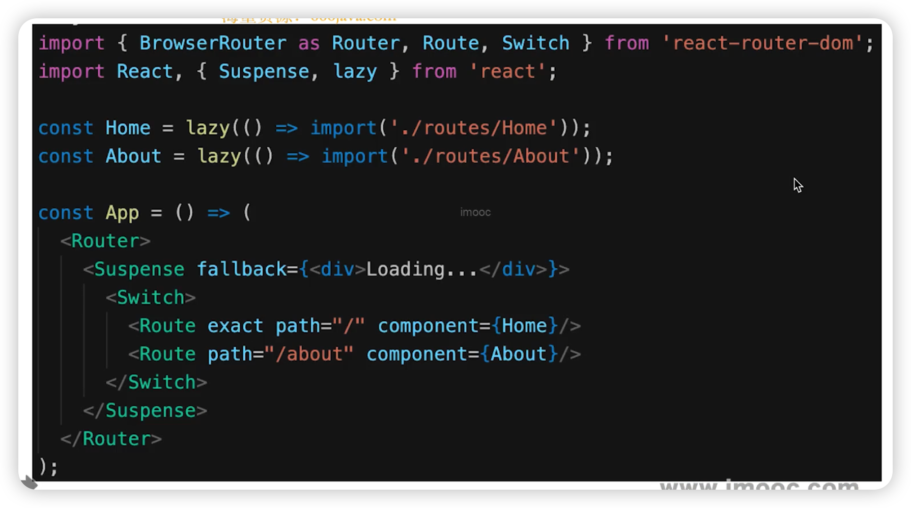

# React 面试题

## 组件之间如何通讯？

* 父子组件 props
* 自定义事件
* Redux 和 Context

## JSX 本质是什么？

* createElement
* 执行返回 vnode

## Context 是什么，如何应用？

* 父组件向子孙组件传递信息
* 如一些简单的公共信息：主题色、语言等
* 复杂的公共信息，请使用 Redux 

## shouldComponentUpda 用途？

* 性能优化
* 配合「不可变值」一起使用，否则会出错

## redux 单项数据流？

## setState 场景题

## 什么是纯函数？

* 返回一个新值，没有副作用
* 重点：不可变值
* 如 `arr1 = arr.slice()`

## React 组件生命周期

* 单组件生命周期
* 父子组件生命周期
* 注意 SCU

## React 发起 ajax 应该放在哪个生命周期？

* componentDidMount

## 渲染列表，为何使用key？

* 必须用 key，且不能是 index 和 random
* diff 算法中通过 tag 和 key 判断，是否是 sameNode
* 减少渲染次数，提升渲染性能

## 函数组件和 class 组件区别

* 纯函数，输入 props，输出 JSX
* 没有实例，没有生命周期，没有 state
* 不能扩展其他方法

## 什么是受控组件？

* 表单的值，受 state 控制
* 需要自行监听 onChange，更新 state
* 对比 非受控组件

## 何时使用异步组件？

* 加载大组件
* 路由懒加载
* 性能优化

## 多个组件有公共逻辑，如何抽离？

* 高阶组件 HOC
* Render props
* mixin 已被弃用

## redux 如何进行异步请求？

* 使用异步 action
* 如 redux-thunk

## react-router 如何配置懒加载？

* 异步组件
* React.lazy
* React.Suspense
* import()

## PureComponent 有何区别？

* 实现了浅比较的 shouldComponentUpdate
* 优化性能
* 要结合不可变值使用

## React 事件和 DOM 事件的区别

* 所有事件挂载到 document 上（React 17 之前版本）
  * React 17 开始，事件挂载 root 组件上
* event 不是原生的，是 SyntheticEvent 合成事件对象
* dispatchEvent

## React 性能优化？

* 渲染列表时加 key
* 自定义事件、DOM 事件及时销毁
* 合理使用异步组件
* 减少函数 bind this 的次数
* 合理使用 SCU PureComponent 和 memo
* 合理使用 Immutable.js
* webpack 层面的优化
* 前端通用的性能优化，如图片懒加载
* 使用 SSR

## React 和 Vue 的区别？

* 都支持组件化
* 都是数据驱动视图
* 都使用 vdom 操作 DOM
* React使用 JSX 拥抱 JS，Vue 使用模板拥抱 html
* React 函数式变成，Vue 声明式编程
* React 更多需要自力更生，Vue 把想要的都给你