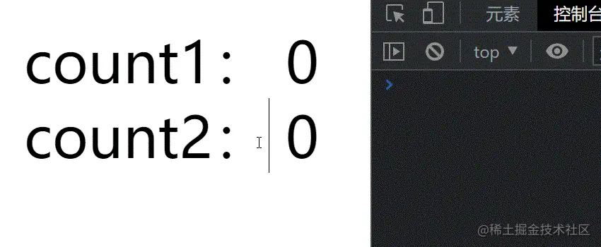
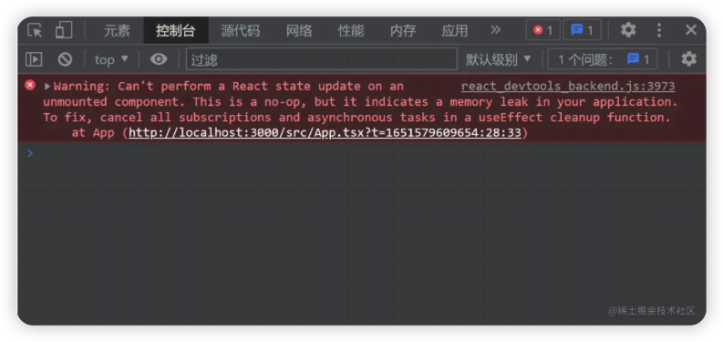
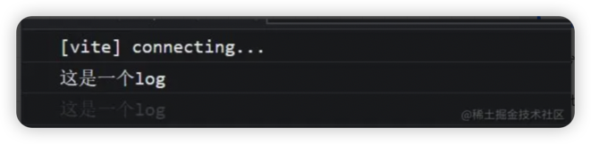

# React18 新特性

https://juejin.cn/post/7094037148088664078#heading-2

https://juejin.cn/post/7182382408807743548

## Render API

```jsx
// React 17
import React from 'react';
import ReactDOM from 'react-dom';
import App from './App';

const root = document.getElementById('root')!;

ReactDOM.render(<App />, root);

// React 18
import React from 'react';
import ReactDOM from 'react-dom/client';
import App from './App';

const root = document.getElementById('root')!;

ReactDOM.createRoot(root).render(<App />);
```

`React 18` 还从 `render` 方法中删除了`回调函数`，因为当使用`Suspense`时，它通常不会有预期的结果。

在新版本中，如果需要在 `render` 方法中使用回调函数，我们可以在组件中通过 `useEffect` 实现：

```jsx
// React 17
const root = document.getElementById('root')!;
ReactDOM.render(<App />, root, () => {
  console.log('渲染完成');
});

// React 18
const AppWithCallback: React.FC = () => {
  useEffect(() => {
    console.log('渲染完成');
  }, []);
  return <App />;
};
const root = document.getElementById('root')!;
ReactDOM.createRoot(root).render(<AppWithCallback />);
```

React18 在定义`props`类型时，如果需要获取子组件`children`，那么你需要`显式的定义它`：

```tsx
// React 17
interface MyButtonProps {
  color: string;
}

const MyButton: React.FC<MyButtonProps> = ({ children }) => {
  // 在 React 17 的 FC 中，默认携带了 children 属性
  return <div>{children}</div>;
};

export default MyButton;

// React 18
interface MyButtonProps {
  color: string;
  children?: React.ReactNode;
}

const MyButton: React.FC<MyButtonProps> = ({ children }) => {
  // 在 React 18 的 FC 中，不存在 children 属性，需要手动申明
  return <div>{children}</div>;
};

export default MyButton;
```

## setState 自动批处理

### 在 React 18 之前

在 `React 18 之前`，我们只在 `React 事件处理函数` 中进行批处理更新。默认情况下，在`promise`、`setTimeout`、`原生事件处理函数`中、或`任何其它事件内`的更新都不会进行批处理：

#### React 事件处理函数中

```tsx
import React, { useState } from 'react';

// React 18 之前
const App: React.FC = () => {
  console.log('App组件渲染了！');
  const [count1, setCount1] = useState(0);
  const [count2, setCount2] = useState(0);
  return (
    <button
      onClick={() => {
        setCount1(count => count + 1);
        setCount2(count => count + 1);
        // 在React事件中被批处理
      }}
    >
      {`count1 is ${count1}, count2 is ${count2}`}
    </button>
  );
};

export default App;
```


可以看到，渲染次数和更新次数是一样的，即使我们更新了两个状态，每次更新组件也只渲染一次。

#### setTimeout 中

```tsx
import React, { useState } from 'react';

// React 18 之前
const App: React.FC = () => {
  console.log('App组件渲染了！');
  const [count1, setCount1] = useState(0);
  const [count2, setCount2] = useState(0);
  return (
    <div
      onClick={() => {
        setTimeout(() => {
          setCount1(count => count + 1);
          setCount2(count => count + 1);
        });
        // 在 setTimeout 中不会进行批处理
      }}
    >
      <div>count1： {count1}</div>
      <div>count2： {count2}</div>
    </div>
  );
};

export default App;
```



可以看到，每次点击更新两个状态，组件都会渲染两次，不会进行批量更新。

#### 原生 js 事件中

```tsx
import React, { useEffect, useState } from 'react';

// React 18 之前
const App: React.FC = () => {
  console.log('App组件渲染了！');
  const [count1, setCount1] = useState(0);
  const [count2, setCount2] = useState(0);
  useEffect(() => {
    document.body.addEventListener('click', () => {
      setCount1(count => count + 1);
      setCount2(count => count + 1);
    });
    // 在原生js事件中不会进行批处理
  }, []);
  return (
    <>
      <div>count1： {count1}</div>
      <div>count2： {count2}</div>
    </>
  );
};

export default App;
```


可以看到，在原生js事件中，结果跟情况二是一样的，每次点击更新两个状态，组件都会渲染两次，不会进行批量更新。

### 在 React 18 中

在 `React 18` 上面的三个例子只会有一次 `render`，因为所有的更新都将自动批处理。这样无疑是很好的提高了应用的整体性能。

**不过以下例子会在 `React 18` 中执行两次 render**：

```tsx
import React, { useState } from 'react';

// React 18
const App: React.FC = () => {
  console.log('App组件渲染了！');
  const [count1, setCount1] = useState(0);
  const [count2, setCount2] = useState(0);
  return (
    <div
      onClick={async () => {
        await setCount1(count => count + 1);
        setCount2(count => count + 1);
      }}
    >
      <div>count1： {count1}</div>
      <div>count2： {count2}</div>
    </div>
  );
};

export default App;
```

### 总结

- 在 18 之前，只有在react事件处理函数中，才会自动执行批处理，其它情况会多次更新
- 在 18 之后，任何情况都会自动执行批处理，多次更新始终合并为一次

## flushSync

批处理是一个`破坏性改动`，如果你想退出批量更新，你可以使用 `flushSync`：

```tsx
import React, { useState } from 'react';
import { flushSync } from 'react-dom';

const App: React.FC = () => {
  const [count1, setCount1] = useState(0);
  const [count2, setCount2] = useState(0);
  return (
    <div
      onClick={() => {
        flushSync(() => {
          setCount1(count => count + 1);
        });
        // 第一次更新
        flushSync(() => {
          setCount2(count => count + 1);
        });
        // 第二次更新
      }}
    >
      <div>count1： {count1}</div>
      <div>count2： {count2}</div>
    </div>
  );
};

export default App;
```

注意：**`flushSync` 函数内部的多个 `setState` 仍然为批量更新**，这样可以精准控制哪些不需要的批量更新。

## 关于卸载组件时的更新状态警告

我们在开发时，偶尔会遇到以下错误：



这个错误表示：**无法对未挂载（已卸载）的组件执行状态更新。这是一个无效操作，并且表明我们的代码中存在内存泄漏**。

实际上，这个错误并不多见，在以往的版本中，这个警告被广泛误解，并且有些误导。

这个错误的初衷，原本旨在针对一些特殊场景，譬如 `你在useEffect里面设置了定时器，或者订阅了某个事件，从而在组件内部产生了副作用，而且忘记return一个函数清除副作用，则会发生内存泄漏……` 之类的场景。

但是在实际开发中，更多的场景是，`我们在 useEffect 里面发送了一个异步请求，在异步函数还没有被 resolve 或者被 reject 的时候，我们就卸载了组件`。 在这种场景中，警告同样会触发。但是，在这种情况下，组件内部并没有内存泄漏，因为这个异步函数已经被垃圾回收了，此时，**警告具有误导性**。

综上所述原因，在 `React 18` 中，官方删除了这个报错。

有关这个报错的更多信息，你可以参阅 React 官方的说明，[点击这里](https://github.com/reactwg/react-18/discussions/82)查看。

## 关于 React 组件的返回值

* 在 `React 17` 中，如果你需要返回一个`空组件`，React只允许返回`null`。如果你显式的返回了 `undefined`，控制台则会在运行时抛出一个错误。
* 在 `React 18` 中，不再检查因返回 `undefined` 而导致崩溃。既能返回 `null`，也能返回 `undefined`（但是 `React 18` 的`dts`文件还是会检查，只允许返回 `null`，你可以忽略这个类型错误）。

## Strict Mode（严格模式）

不再抑制控制台日志：

当你使用 `严格模式 `时，React 会对每个组件进行`两次渲染`，以便你观察一些意想不到的结果。在 `React 17` 中，取消了`其中一次渲染`的控制台日志，以便让日志更容易阅读。

为了解决社区对这个问题的困惑，在 `React 18` 中，官方取消了这个限制。如果你安装了`React DevTools`，第二次渲染的日志信息将显示为灰色，以柔和的方式显式在控制台。



官方解释：https://github.com/reactwg/react-18/discussions/96

## Suspense 不再需要 fallback 来捕获

在 `React 18` 的 `Suspense` 组件中，官方对 `空的fallback` 属性的处理方式做了改变：不再跳过 `缺失值` 或 `值为null` 的 `fallback` 的 `Suspense` 边界。相反，会捕获边界并且向外层查找，如果查找不到，将会把 `fallback` 呈现为 `null`。

### 更新前

以前，如果你的 `Suspense` 组件没有提供 `fallback` 属性，React 就会悄悄跳过它，继续向上搜索下一个边界：

```tsx
// React 17
const App = () => {
  return (
    <Suspense fallback={<Loading />}> // 这个边界被使用，显示 Loading 组件
      <Suspense>                      // 这个边界被跳过，没有 fallback 属性
        <Page />
      </Suspense>
    </Suspense>
  );
};

export default App;
```

React 工作组发现这可能会导致混乱、难以调试的情况发生。例如，你正在debug一个问题，并且在没有 `fallback` 属性的 `Suspense` 组件中抛出一个边界来测试一个问题，它可能会带来一些意想不到的结果，并且 `不会警告` 说它 `没有fallback` 属性。

### 更新后

现在，React 将使用当前组件的 `Suspense` 作为边界，即使当前组件的 `Suspense` 的值为 `null` 或 `undefined`：

```tsx
// React 18
const App = () => {
  return (
    <Suspense fallback={<Loading />}> // 不使用
      <Suspense>                      // 这个边界被使用，将 fallback 渲染为 null
        <Page />
      </Suspense>
    </Suspense>
  );
};

export default App;
```

这个更新意味着我们`不再跨越边界组件`。相反，我们将在边界处捕获并呈现 `fallback`，就像你提供了一个返回值为 `null` 的组件一样。这意味着被挂起的 `Suspense` 组件将按照预期结果去执行，如果忘记提供 `fallback` 属性，也不会有什么问题。

官方解释：https://github.com/reactwg/react-18/discussions/72

## 新的 API

### useId

```js
const id = useId();
```

支持同一个组件在客户端和服务端生成相同的唯一的 ID，避免 `hydration` 的不兼容，这解决了在 `React 17` 及 `17` 以下版本中已经存在的问题。因为我们的服务器渲染时提供的 `HTML` 是`无序的`，`useId` 的原理就是每个 `id` 代表该组件在组件树中的层级结构。

官方解释：https://github.com/reactwg/react-18/discussions/111

