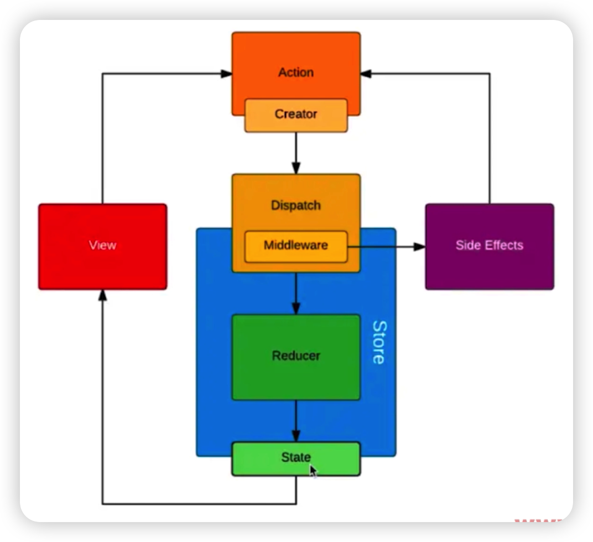

# redux 和 mobx 区别

- Redux 的编程范式是函数式的而 Mobx 是面向对象的
- 因此数据上来说 Redux 理想的是 immutable（不可变值），每次都返回一个新的数据，而 Mobx 从始至终都是一份引用
- 然而和Redux相比，使用mobx的组件可以做到精准更新，这一点得益于Mobx的observable；对应的Redux是用dispath进行广播，通过Provider和connect来比对前后差别控制更新粒度；Mobx更加精细，MobX背后的哲学很简单:**任何源自应用状态的东西都应该自动地获得**。

## Redux

### 核心思想

* store 中存放公共 state
* view 中的 state 从 store 中获取
* view 中可以触发 action
* action 中携带了新的 state 信息，被发送到 store
* store 中通过一些函数来接受 action 中携带的 newState，并将 newState 更换之前的 state
* store 中 state 发生变化后，凡是使用该 state 的 view 会自动重新渲染

UI绑定库 react-redux

### 核心 API

* const store = createStore(reducer, initState)
  * store.dispatch
  * store.getState
  * 一个项目有且只有一个 store
  * 多个 store 增强器，使用 compose
* Store
  * 用来维持所有 state 树的一个对象，修改 store 内 state 的唯一途径对他 dispatch 一个action
  * getState
  * dispatch(action)
  * subscribe(listener) 变化监听器，在回调函数中通过 getState 拿到当前 state
  * replaceReducer
* combineReducers 将多个子 reducer 函数合并为一个 reducer 函数，形成一个 rootReducer
* applyMiddleware - 使用自定义功能的中间件
* bindActionCreators
* compose - 从右到左来组合多个函数，多个 store 增强器
  * 返回值：从右到左把接收到的函数合成后的最终函数

### 相关库

* react-redux
  * `<Provider store>`
  * `connect([mapStateToProps], [mapDispatchToProps], [mergeProps], [options])`
* redux-toolkit
* redux-devtools

### 中间件

提供了一种对基础数据流扩展自定义功能的方式

* redux-thunk 中间件
  * 让 dispatch 的参数支持 function
  * 优化应用的异步处理逻辑

## Mobx

### 官方文档

https://cn.mobx.js.org

### 核心概念

* Action
* State
* Reaction

### 核心API

* observable -- 将数据变为可观察的对象
  * @observer 观察者
* @computed、autorun、when、reaction -- 可观察对象发生变化后做出对应的响应
* runInAction
* 异步方法 async await
* 观察者 - 通常是组件
* 被观察者 - 通常是 State

### 生态

- mobx
- mobx-react
  - Provider
  - @inject

## 数据流

### Redux 数据流

触发action，匹配到对应的reducer, 修改store中的数据，store中的数据发生改变，触发render方法，重新渲染页面UI

### Mobx 数据流

触发action，在action中修改state，通过computed拿到state的计算值，自动触发对应的reactions，这里包含autorun，渲染视图等。

## 区别

- redux 全局存在一个store进行状态管理（集中式管理）
- mobx 存在多个store进行状态管理(每个组件都可以定义成单独的store)
- 相较于 redux 中使用 middleware 来处理异步，mobx 中不需要那么复杂，只需要使用async/await 来优雅的处理异步的逻辑

## 观察者模式

