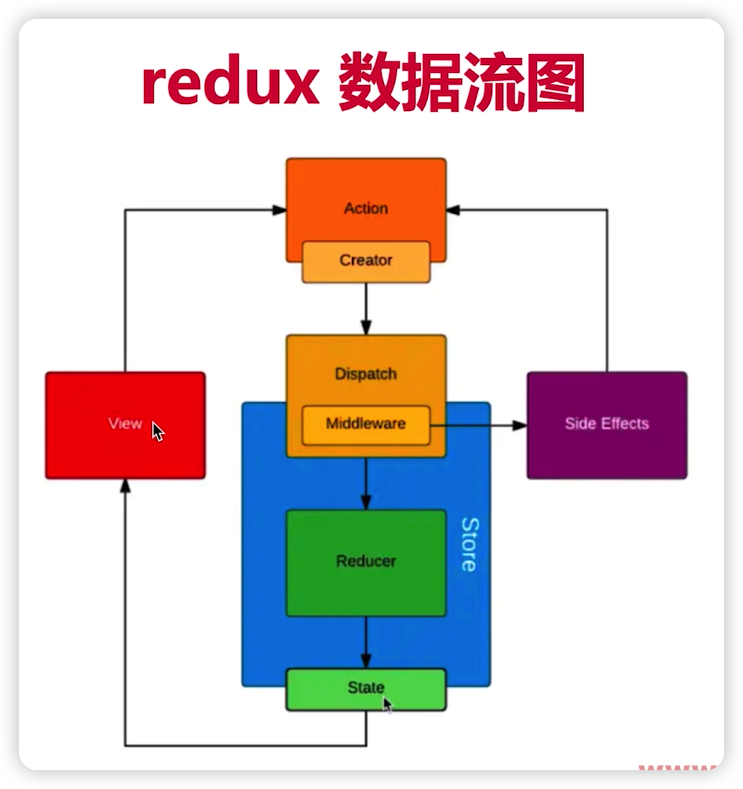
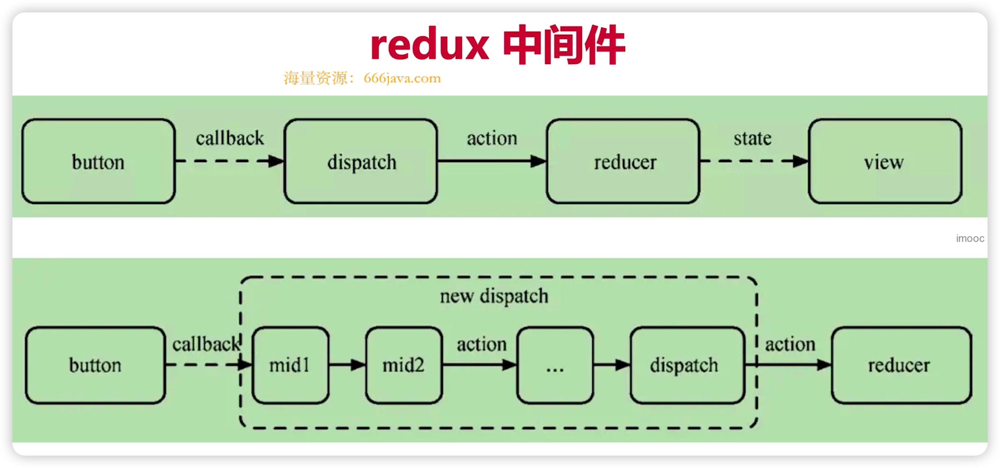
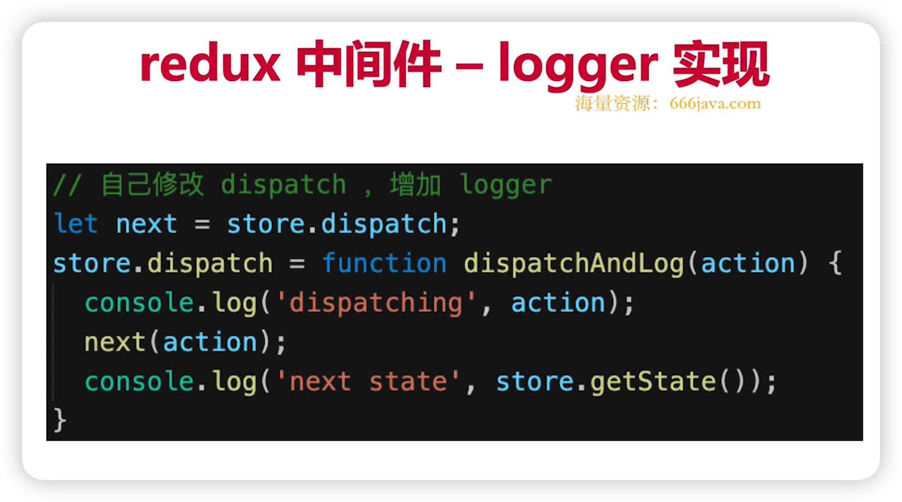

# 基本概念

* store state
* action
* reducer

# 单项数据流

* dispatch(action)
* reducer => newState
* subscribe 触发通知

# react-redux

* Provider
* connect
* mapStateToProps
* mapDispatchToProps

# 异步 action

* react-thunk
* react-promise
* redux-saga

# 中间件

## 原理

