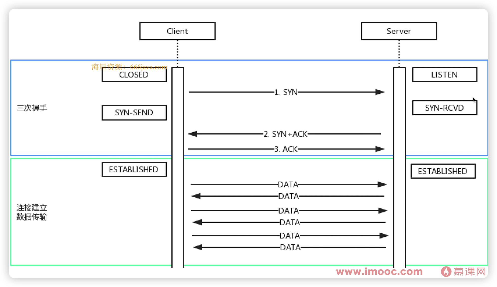
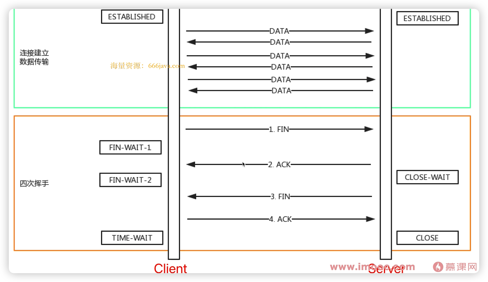
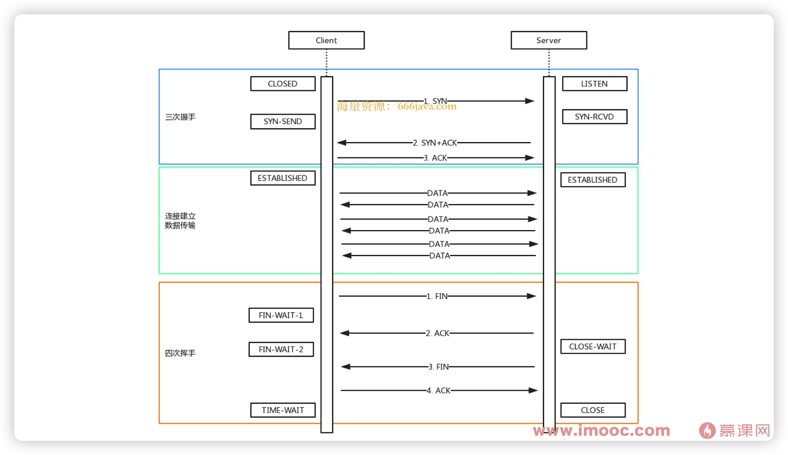

# TCP三次握手四次挥手

* 建立 TCP 链接，确保双方都有收发消息的能力
* 网络链接是 TCP 协议，传输内容是 HTTP 协议

## 三次握手 - 建立链接

* Client 发包，Server 接收。Server：有 Client 要找我
* Server 发包，Client 接收。Client：Server 已经收到消息了
* Client 发包，Server 接收。Server：Client 要准备发送了

## 四次挥手 - 关闭链接

* Client 发包，Server 接收。Server：Client 已请求结束
* Server 发包，Client 接收。Client：Server已收到，我等待它关闭
* Server 发包，Client 接收。Client：Server 此时可以关闭链接了
* Client 发包，Server 接收。Server：可以关闭了（然后关闭链接）

## 总流程

## 总结

握手是链接，挥手是告别