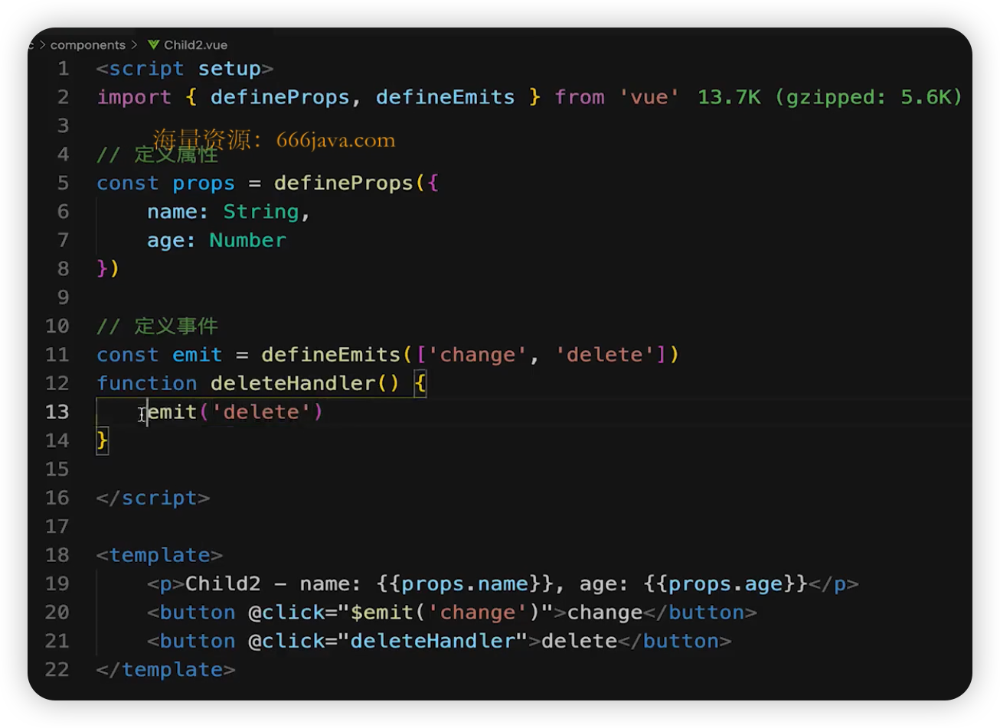

# 面试题

* Vue3 比 Vue2 有什么优势？
* 描述 Vue3 生命周期
* 如何看待 Composition API 和 Options API?
* 如何理解 ref toRef 和 toRefs？
* Vue3 升级了哪些重要的功能？
* Composition API 如何实现代码逻辑复用？
* Vue3 如何实现响应式？
* watch 和 watchEffect 的区别是什么？
* setup 中如何获取组件实例？
* Vue3 为何比 Vue2 快？
* Vite 是什么？
* Composition API 和 React Hooks 的对比？

## Vue3 比 Vue2 有什么优势？

* 性能更好
* 体积更小
* 更好的 ts 支持（Vue3 ts开发）
* 更好的代码组织
* 更好的逻辑抽离
* 更多新功能

## Vue3 生命周期

变动

* beforeDestroy 改为 beforeUnmount
* destroyed 改为 unmounted
* 其它沿用 Vue2 生命周期

生命周期函数

* setup 代替 beforeCrate created，在之前执行
* onBeforeMount
* onMounted
* onBeforeUpdate
* onUpdated
* onBeforeUnmount
* onUnmounted

## Composition API 对比 Options API

### Composition API 带来了什么？

* 更好的代码组织
* 更好的逻辑复用
* 更好的类型推导

## 如何理解 ref toRef 和 toRefs？

### ref

* 生成值类型的响应数据
* 可用于模板和 `reactive`
* 通过 `.value` 修改值
* 可以获取 Dom 元素

### toRef

* 针对一个响应式对象（reactive 封装）的 prop
* 创建一个 ref，具有响应式
* 两者保持引用关系

### toRefs

* 将响应式对象（reactive 封装）转换为普通对象
* 对象的每个 prop 都是对应的 ref
* 两者保持引用关系

### 最佳使用方式

* 用 reactive 做对象的响应式，用 ref 做值类型响应式
* setup 中返回 toRefs(state) 或者 toRef(state, 'xxx')
* ref 变量命名都用 xxxRef
* 合成函数返回响应式对象时，使用 toRefs，方便使用方解构

## 为什么要用 ref？

* 返回值类型，会丢失响应式
* 如在 setup、computed、合成函数，都有可能返回值类型

## 为何需要 .value?

* ref 是一个对象，value存储值
* 通过 .value 属性的 get 和 set 实现响应式
* 用于模板、reactive时，不需要 .value, 其它情况都需要

## Vue3 升级了哪些重要功能？

* createApp
* emits 属性
* 生命周期
* 多事件处理
* Fragment
* 移除 .sync
* 异步组件的写法
* 移除 filter
* Teleport
* Suspense
* Composition API

### createApp

### emits 属性

### 多事件处理

### Fragment

### 移除 .sync

### 异步组件

`defineAsyncComponent`

### 移除 filter

### Teleport

与 React Portals 功能类似，将一个组件渲染到最外层

### Suspense

和 React.Suspense 功能类似，渲染异步组件，显示一个 loading

### Composition API

* setup
* reactive
* ref 相关
* readonly
* watch 和 watchEffect
* 生命周期钩子函数

## Composition API 实现逻辑复用？

* 抽离逻辑代码到一个函数
* 函数命名约定为 useXxx 格式（React Hooks）

## Vue3 如何实现响应式？

* Vue2 的 Object.defineProperty
  * 缺点：深度监听需要一次性递归
  * 缺点：无法监听新增属性和删除属性（Vue.set Vue.delete）
  * 缺点：无法原生监听数组，需要特殊处理
* Vue3 的 Proxy
  * Reflect

### Proxy 基本使用

## setup 中如何获取组件的实例

* 在setup 中和其它 Composition API 中没有this
* 可通过 `getCurrentInstance` 获取当前组件实例
* 若使用 Options API 可照常使用 this

## Vue3 为何比 Vue2 快？

* Proxy 响应式
* PatchFlag 静态标记
  * 编译模板时，动态节点做标记
  * 标记，分为不同的类型，如 TEXT PROPS
  * diff 算法时，可以区分静态标记，以及不同类型的动态标记
* hoistStatic
* cacheHandler
* SSR 优化
* tree-shaking

## Composition API 和 React Hooks 对比

* 前者 setup 只会被调用一次，后者函数会被多次调用
* 前者无需 useMemo useCallback，因为 setup 只会调用一次
* 前者无需顾虑调用顺序，而后者需要保证 hooks 的顺序一致
* 前者 reactive + ref 比后者 useState 难理解

## Vite 为何启动快？

* 开发环境使用 ES6 Module，无需打包 -- 非常快
* 生产环境使用 rollup，并不是快很多

## Vue3 中使用 JSX

方式一：.vue 文件

方式二：.jsx 文件

defineComponent

## JSX 和 template 区别？

## Vue3 script setup

Vue3 3.2 版本增加

* defineProps 定义属性
* defineEmits 定义事件
* defineExpose 暴露数据给父组件

### 总结

* 基本使用，`<script>` 写在 `<template>` 前面
* 定义属性 defineProps, 定义事件 defineEmits
* defineExpose 暴露数据给父组件

