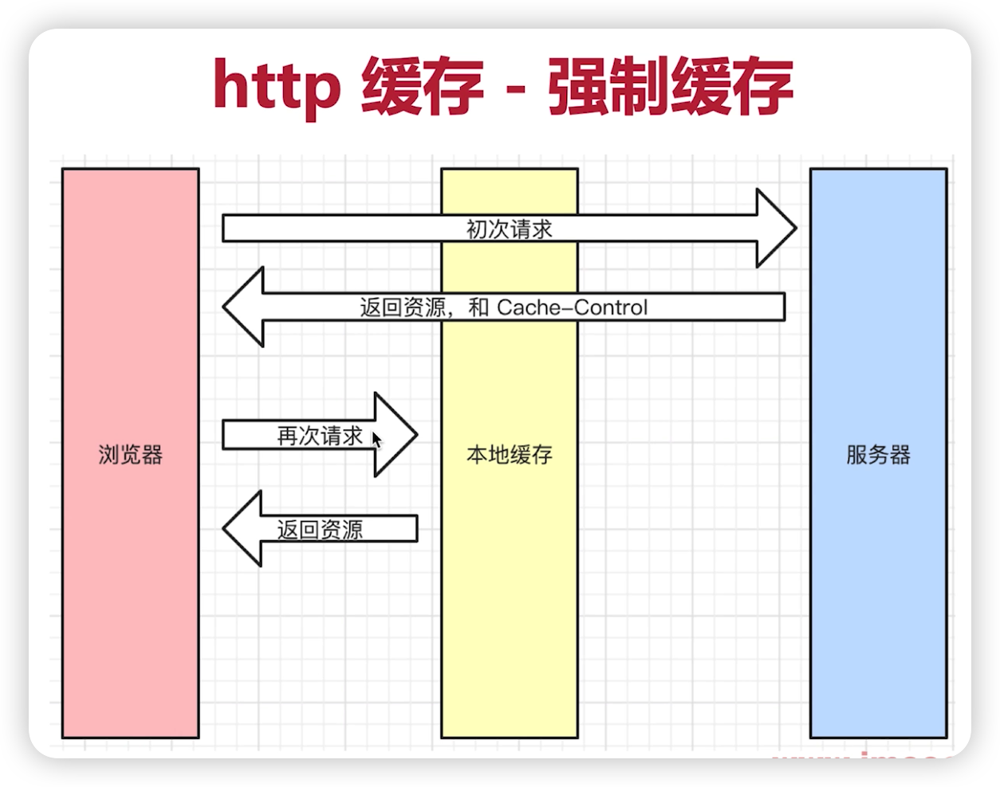
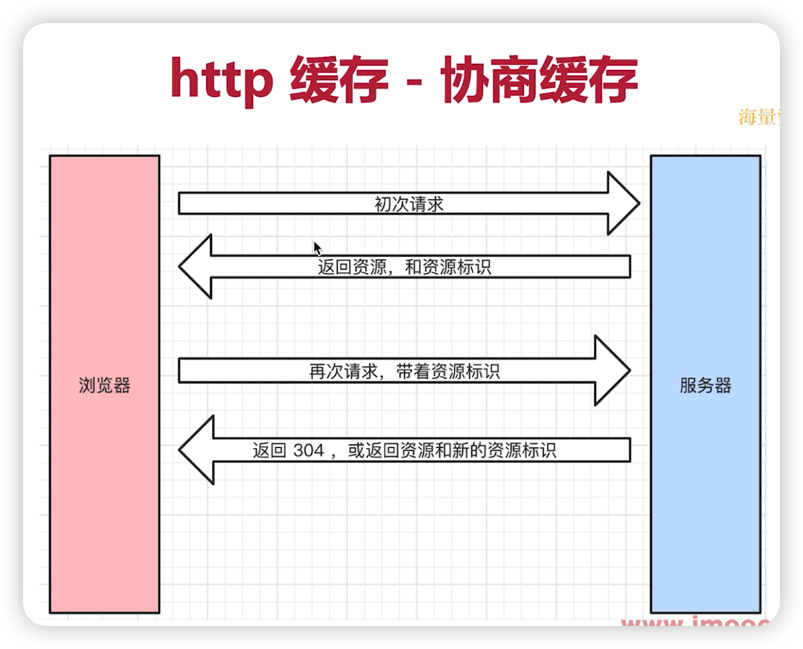
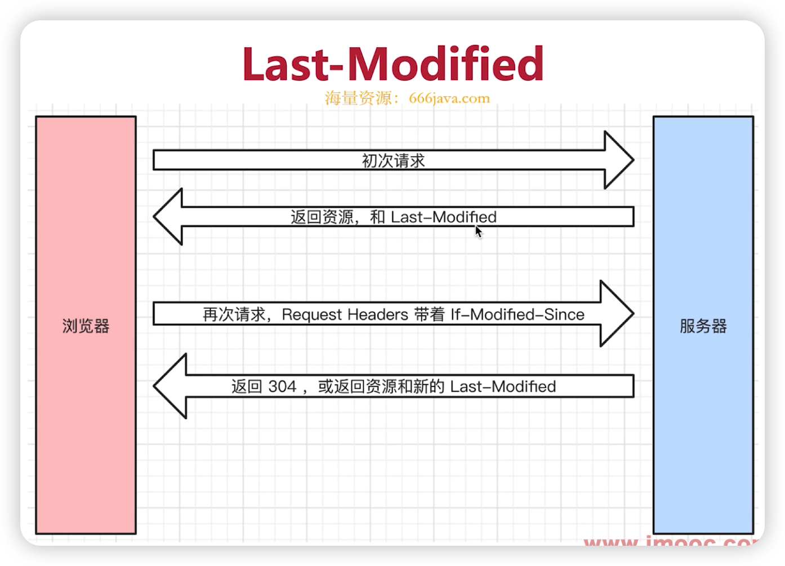
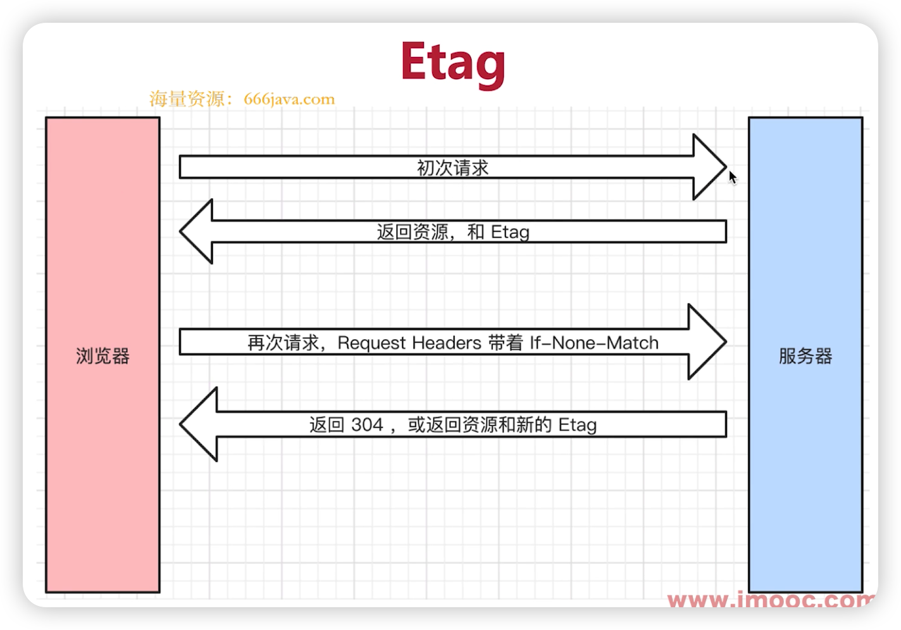
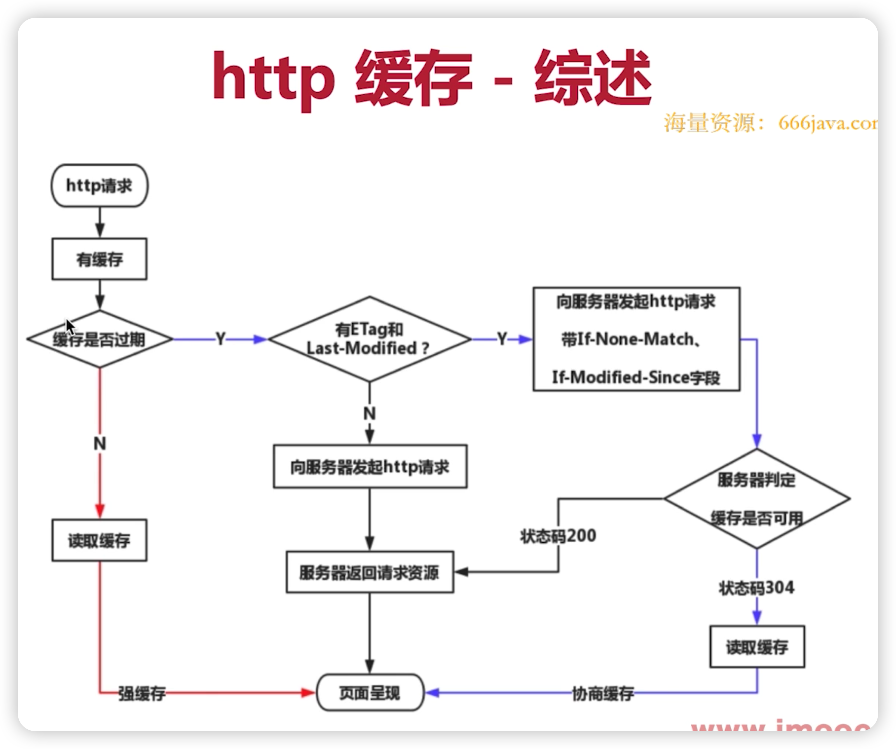
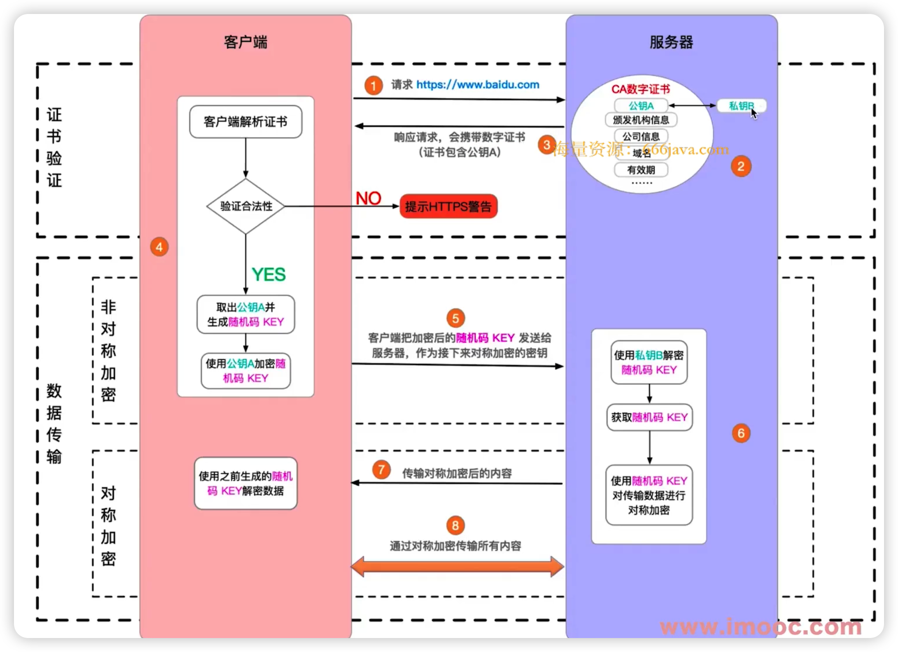
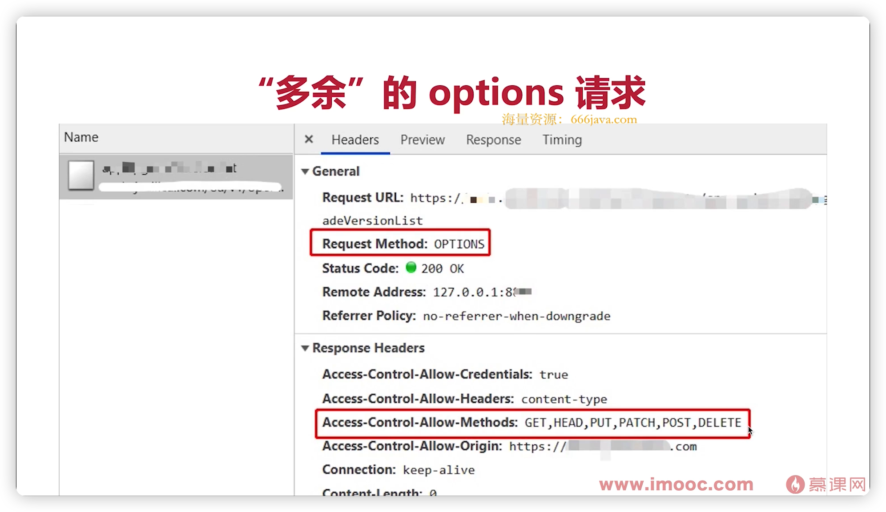

* http 常见状态码
* 常见的 header
* restful api
* http 缓存机制（重要）

# http 状态码

## 分类

* 1xx 服务器收到请求
* 2xx 请求成功
* 3xx 重定向
* 4xx 客户端错误
* 5xx 服务端错误

## 常见状态码

* 200 成功
* 301 永久重定向，配合location，浏览器自动处理
* 302 临时重定向，配合location，浏览器自动处理
* 304 资源未被修改
* 404 资源未找到
* 403 没有权限
* 500 服务器错误
* 504 网关超时

## 关于协议和规范

* 就是一个约定
* 要求大家都跟着执行
* 不要违反规范

# http methods

## 传统 methods

* get 获取服务器数据
* post 向服务器提交数据

## 现在 methods

* get 获取数据
* post 新建数据
* patch/put 更新数据
* delete 删除数据

## Restful API

* 一种新的 API 设计方法
* 传统 API 设计：把每个 url 当做一个功能
* Restful API 设计：把每个 url 当做一个唯一的资源

## 如何设计成一个资源？

* 尽量不用 url 参数
* 用 method 表示操作类型

# http headers

## Request Headers

* Accept 浏览器可接收的数据格式
* Accept-Encoding 浏览器可接收的压缩算法，如 gzip
* Accept-Languange 浏览器可接收的语言，如 zh-CN
* Connection: keep-alive 一次 TCP 链接重复使用
* Cookie
* Host
* User-Agent（UA）浏览器信息
* Content-Type 发送数据的格式，如 application/json

## Response Headers

* Content-type 返回数据的格式，如 application/json
* Content-length 返回数据的大小，多少字节
* Content-Encoding 返回数据的压缩算法，如 gzip
* Set-Cookie

## 自定义 header

## 缓存相关的 headers

* Cache-Control
* Expires
* Last-Modified
* If-Modified-Since
* Etag
* If-None-Match

# http 缓存

## 关于缓存

* 什么是缓存？
* 为什么需要缓存？
* 哪些资源可以被缓存？- 静态资源（js css img）

## 强制缓存



### Cache-Control

* Response Headers 中
* 控制强制缓存的逻辑
* 例如 Cache-Control: max-age=31536000（单位秒）

### Cache-Control 的值

* max-age 缓存过期时间
* no-cache 不用本地缓存
* no-store 不用本地缓存，也不用服务端缓存措施
* private 只允许最终用户做缓存
* public 允许中间的路由、代理等做缓存

### Expires

* 同在 Response Headers 中
* 同为控制缓存过期
* 已被 Cache-Control 代替

## 协商缓存

* 服务器端缓存策略
* 服务器判断客户端资源，是否和服务端资源一样
* 一致则返回 304，否则返回 200 和最新的资源



### 资源标识

* 在 Response Headers 中，有两种
* Last-Modified 资源的最后修改时间
* Etag 资源的唯一标识（一个字符串，类似人类的指纹）
* 如果两者同时存在，优先使用 Etag
* Last-Modified 只能精确到秒级
* 如果资源被重复生成，而内容不变，则 Etag 更精准





## 完整流程图



## 三种刷新操作

* 正常操作：地址栏输入地址
  * 强制缓存有效，协商缓存有效
* 手动刷新
  * 强制缓存失效，协商缓存有效
* 强制刷新：ctrl + f5
  * 强制缓存失效，协商缓存失效

# https

* http 明文传输，敏感信息容易被拦截
* https = http + 加密

## 加密方式

* 对称加密：一个 key 同时负责加密和解密
* 非对称加密：一个 key 加密，一个 key 解密
* https 同时用到了这两种加密方式

## https 证书

* 中间人攻击 - 调包
* 使用第三方证书 - 避免中间人攻击
* 浏览器校验证书



# 跨域请求为何发送 Options 请求？

* JSONP
  * 页面中定义一个全局函数（onSuccess）
  * 接口返回一个字符串调用全局方法（onSuccess）
  * onSuccess 接收到接口数据
* CORS   在服务端设置请求头
  * Access-Control-Allow-Origin - `*` or `指定域名`
  * Access-Control-Allow-Headers - `X-Requested-With`
  * Access-Control-Allow-Methods - `GET,PUT,POST,PATCH,DELETE,OPTIONS`
  * Access-Control-Allow-Credentials - `true` 允许跨域接收 cookie

* options 请求，是跨域请求之前的预检查
  * 比如发起一个 GET 请求，浏览器先发起一个options到服务器看下是否支持 get 请求跨域
  * 浏览器自行发起，可忽略
  * 不影响功能




## http2.0 特性

1. **二进制协议**：传输内容是二进制，可以使用二进制压缩算法和多路复用技术。http1.1采用文本格式。
2. **支持多路复用**： 同一个 tcp 连接上支持多个请求和响应。减少不必要的延迟和重复的TCP握手。
3. **首部压缩**：采用 HPACK 算法对头部进行压缩，减小协议头的大小。可以减少网络带宽的占用和网络传输的延迟。
4. **服务端推送**：支持服务端向客户端主动发送请求，减少等待时间，提高用户体验。
5. **TLS 加密要求**


### HTTP1.1 升级到 http2.0

1. 检查服务器是否支持 http2.0，http2.0 要求使用 SSL/TLS 进行加密。
2. 配置 SSL/TLS
3. 配置 web 服务器，以支持 http2.0

Apache:

```v
<IfModule http2_module>
  LogLevel http2:info
  Protocols h2 http/1.1
  ...
</IfModule>
```

Nginx

```nginx
listen 443 ssl http2;
ssl_protocols TLSv1.2 TLSv1.3;
...
```

4. 修改网页代码以利用 HTTP/2.0 特性。


