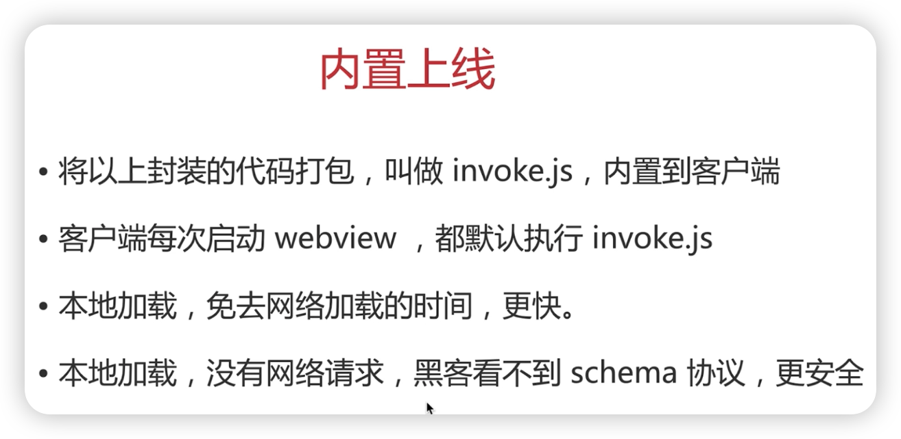

# hybrid

* hybrid 概念
* 存在价值
* webview
* file:// 协议
* hybrid 实现流程

## hybrid 概念

## 存在价值

## webview

## file 协议

* file 协议：本地文件，快
* http(s) 协议：网络加载，慢

## 实现流程

## 更新上线流程

* 每次 app 打开去服务端下载最新的静态文件
* 打包上传，app 端去server端下载包，然后解压
* 版本管理，可通过时间戳

## JS 和客户端通讯

* schema 协议
* 不能 ajax 获取，第一跨域，第二速度慢
* 客户端获取内容，然后 JS 通讯拿到内容渲染

