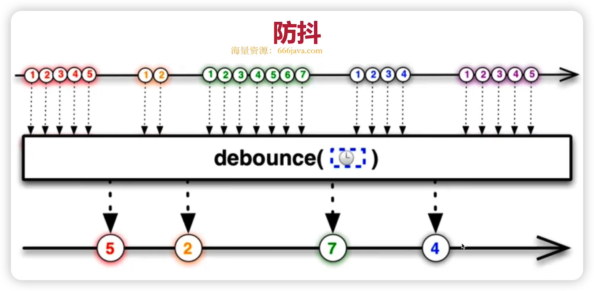
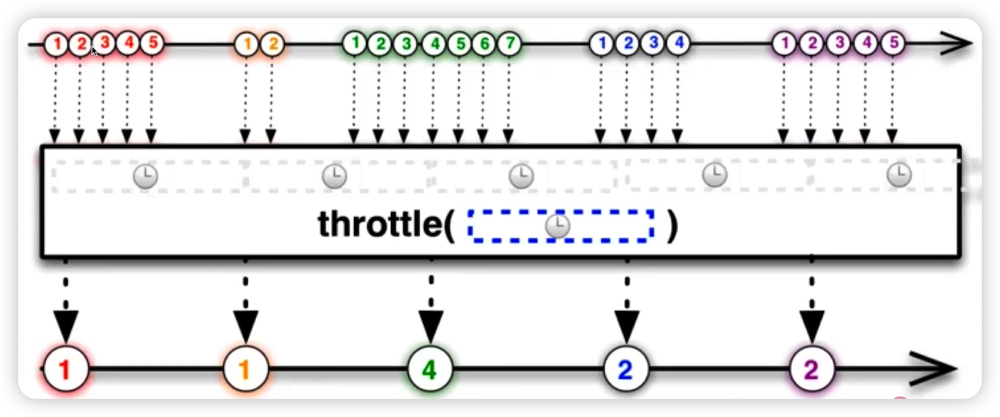

# 节流和防抖

* 两者区别
* 使用场景

## 防抖

* 防止抖动
* 例如，一个搜索输入框，等输入停止之后，再触发搜索

```js
// 防抖
function debounce(fn, delay = 200) {
  let timer = null;
  return function() {
    if(timer) clearTimeout(timer);
    
    timer = setTimeout(() => {
      fn.apply(this, arguments)
      timer = null;
    }, delay)
  }
}
```



## 节流

* 节省交互沟通
* 一个一个来，按时间节奏来
* 例如，drag 或 scroll 期间触发某个回调，要设置一个时间间隔

```js
// 节流
function throttle(fn, delay = 200) {
  let timer = null;
  return function() {
    if(timer) return;
    
    timer = setTimeout(() => {
      fn.apply(this, arguments)
      timer = null;
    }, delay)
  }
}
```



## 区别

* 节流：限制执行频率，有节奏的执行
* 防抖：限制执行次数，多次密集的接触只执行一次
* 节流关注「过程」，防抖关注「结果」