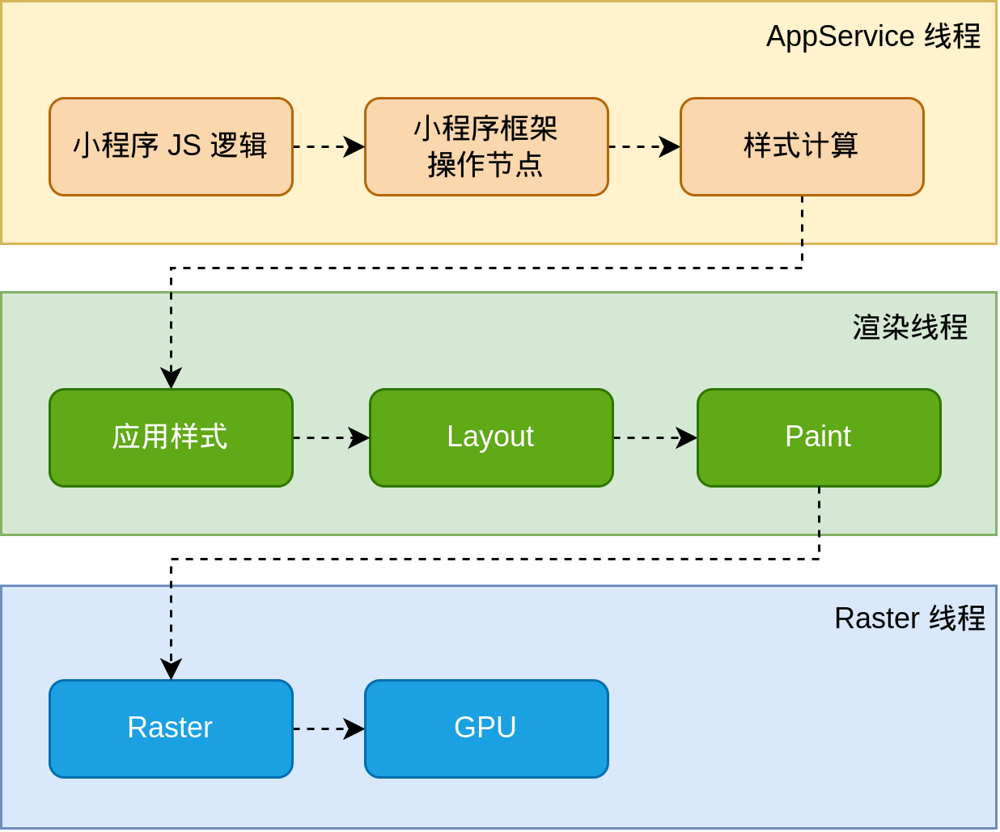

# 生命周期

# 小程序的运行环境

整个小程序框架系统分为两部分：**[逻辑层](https://developers.weixin.qq.com/miniprogram/dev/framework/app-service/)**（App Service）和 **[视图层](https://developers.weixin.qq.com/miniprogram/dev/framework/view/)**（View）。小程序提供了自己的视图层描述语言 `WXML` 和 `WXSS`，以及基于 `JavaScript` 的逻辑层框架，并在视图层与逻辑层间提供了数据传输和事件系统，让开发者能够专注于数据与逻辑。

小程序的运行环境分成渲染层和逻辑层，其中 WXML 模板和 WXSS 样式工作在渲染层，JS 脚本工作在逻辑层。

小程序的渲染层和逻辑层分别由2个线程管理：渲染层的界面使用了WebView 进行渲染；逻辑层采用JsCore线程运行JS脚本。一个小程序存在多个界面，所以渲染层存在多个WebView线程，这两个线程的通信会经由微信客户端（下文中也会采用Native来代指微信客户端）做中转，逻辑层发送网络请求也经由Native转发，小程序的通信模型下图所示。

# 渲染流程

小程序一直以来采用的都是 AppService 和 WebView 的双线程模型

* Skyline

当小程序基于 WebView 环境下时，WebView 的 JS 逻辑、DOM 树创建、CSS 解析、样式计算、Layout、Paint (Composite) 都发生在同一线程，在 WebView 上执行过多的 JS 逻辑可能阻塞渲染，导致界面卡顿。以此为前提，小程序同时考虑了性能与安全，采用了目前称为「双线程模型」的架构。

在 Skyline 环境下，我们尝试改变这一情况：Skyline 创建了一条渲染线程来负责 Layout, Composite 和 Paint 等渲染任务，并在 AppService 中划出一个独立的上下文，来运行之前 WebView 承担的 JS 逻辑、DOM 树创建等逻辑。这种新的架构相比原有的 WebView 架构，有以下特点：

* 界面更不容易被逻辑阻塞，进一步减少卡顿
* 无需为每个页面新建一个 JS 引擎实例（WebView），减少了内存、时间开销
* 框架可以在页面之间共享更多的资源，进一步减少运行时内存、时间开销
* 框架的代码之间无需再通过 JSBridge 进行数据交换，减少了大量通信时间开销

