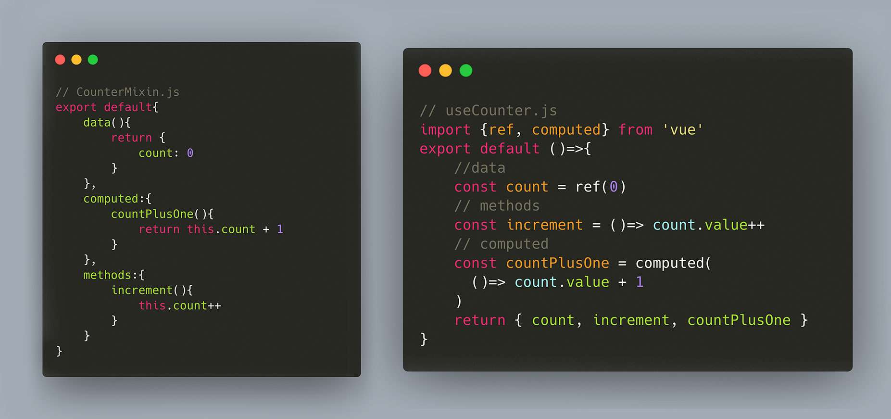
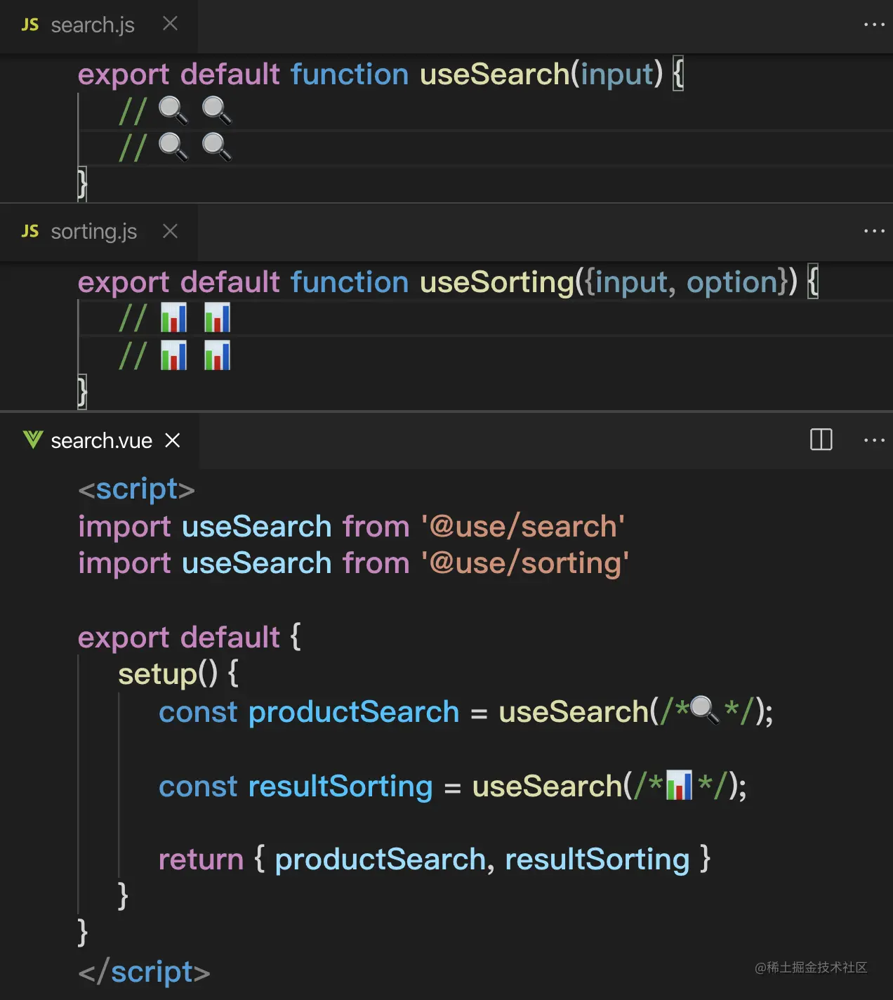

# Vue3 为什么要使用 Composition API?

使用Vue2开发的项目，普遍存在的问题：

- 代码的可读性随着组件变大而变差
- 每一种代码复用的方式，都存在缺点
- TypeScript支持有限

## 代码的可读性随着组件变大而变差


## 没有一个完美的代码复用方案



### Vue2 复用1 - Mixins

Mixins的优点： 可以将代码按照功能组织区分

Mixins的缺点：

* 变量来源不明确（隐式传入），不利于阅读，使代码变得难以维护
* 存在命名冲突隐患，你有可能在使用过程中出现属性或函数的命名冲突
* 依赖关系不清晰，特别是在多个 Mixins 存在交流的情况下
* 逻辑复用不够灵活，如果你需要在不同的组件间差异化或配置化使用 Mixins 的话

### Vue2 复用2 - Mixin Factory

使用一个工厂函数，根据传入配置，返回对应的Mixin内容。 上面的3和4，可以通过使用Mixin Factory方式部分解决，但是依然无法解决的是：

* 重名隐患始终存在
* 属性来源依然不清晰，需要进入每个 Minxin 文件内查看暴露的属性
* 没有跑在运行时，因此 Mixin 工厂函数**没法动态生成**

```js
// mixins/factories/search.js
export default function searchMixinFactory({ ... }) {
    // 搜索功能
}

// mixins/factories/sorting.js
export default function sortingMixinFactory({ ... }) {
    // 整理功能
}

// search.vue
import searchMixinFactory from '@mixins/factories/search';
import sortingMixinFactory from '@mixins/factories/sorting';

export default {
    mixins: [
        searchMixinFactory({
            namespace: 'productSeatch',
            // ...搜索配置参数
        }),
        sortingMixinFactory({
            namespace: 'resultSorting',
            // ...排序配置参数
        })
    ],
};
```

### Vue2 复用3 - Scoped Slots

Vue2 中第三种逻辑复用的方法是使用作用域插槽。

优点： 解决了上面的所有缺点 

缺点：

* 配置只能写在template上
* 增加了模板嵌套，降低可读性
* 暴露的属性只能在template上使用
* 实现相同的功能需要嵌套更多的组件，性能降低

## Vue3 代码复用

Vue3 的 Composition API 提供了第四种代码复用的解决方案，通过对可复用代码的抽离：



这样，我们可以对复用的逻辑进行随意的组合和配置，并放入setup函数内执行。

优点：

* 没有了各种分散的区块，我们可以写更少的代码，也更容易将可以复用的逻辑从组件里抽出到函数里。
* 比原有的 Mixins 或 Slot 方式都更加灵活

缺点： 除了要用一下新的语法，好像也没别的缺点了